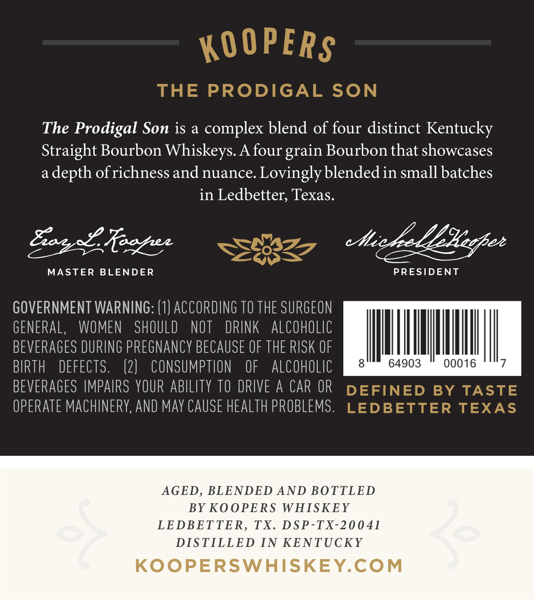
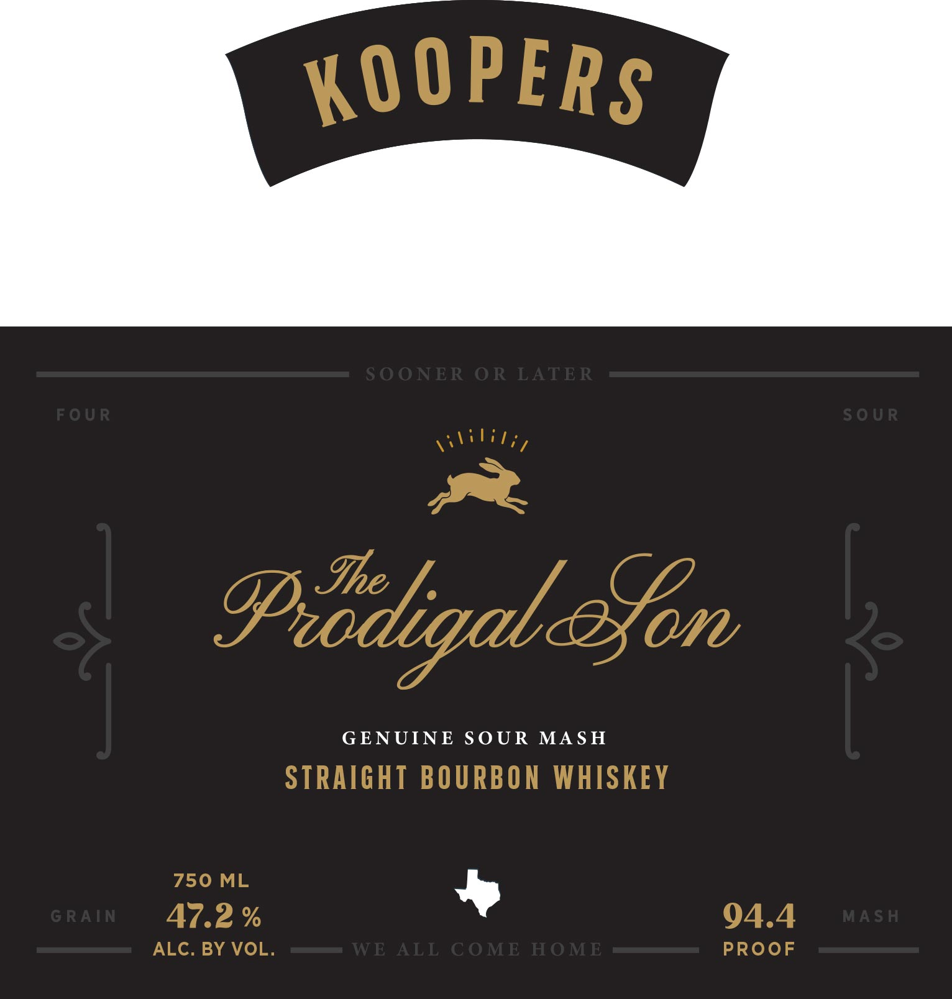

# TTB COLA Label Images - TTBID 26119001000291

**Brand Name:** KOOPERS

**Fanciful Name:** THE PRODIGAL SON

**Issue Date:** 05/04/2026

**Origin Code:** 44

**Product Class/Type:** 101

**Source:** [TTB Public COLA Registry](https://ttbonline.gov/colasonline/viewColaDetails.do?action=publicFormDisplay&ttbid=26119001000291)

## Label Images

### Back Label

### Front Label

## Extracted Label Text

*Text extracted via OCR - may contain errors*

**Detected Proof:** 94.4

### Back Label

KOOPERS
THE
PRODIGAL
SON
The Prodigal Son is a
complex blend of four distinct Kentucky
Straight Bourbon Whiskeys A four grain Bourbon that showcases
a
depth of richness and nuance. Lovingly blendedin small batches
in Ledbetter; Texas.
892 Reezez
etie /e LEEeehee
MASTER
BLENDER
PRESIDENT
GOVERNMENT WARNING: (1) ACCORDING TO THE SURGEON
GENERAL,
WOMEN
SHOULD
NOT
DRINK
alcoholic
BEVERAGES DURING PREGNANcy BECAUSE OF THE RISK OF
BIRTH
DEFECTS.
(2)
CONSUMPTION
OF
alcoholIC
8
64903
00016
BEVERAGES IMPAIRS YOUR ABILITY TO DRIVE A
CAR OR
DEFINED
BY
TASTE
OPERATE MAChINERY,AND May CAUSE HEALTH PROBLEMS.
LEDBETTER TEXAS
AGED, BLENDED AND BOTTLED
BY KOOPERS WHISKEY
LEDBETTER,
TX
DSP-TX-20041
DISTILLED IN KENTUCKY
3e
KOOPERSWHISKEYCOM

### Front Label

KO OPERS
S OONER OR LATER
FOUR
S0 UR
IpiodigaleSon
3
GENUINE
S OUR
MA S H
STRAIGHT BOURBON WHISKEY
750 ML
G RAIN
47.2 %
94.4
MA SH
ALC. BY VOL.
WE ALL COME HOME
PROoF
16l;l;i,
