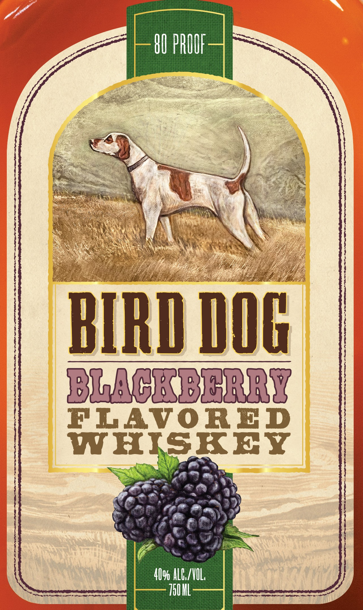
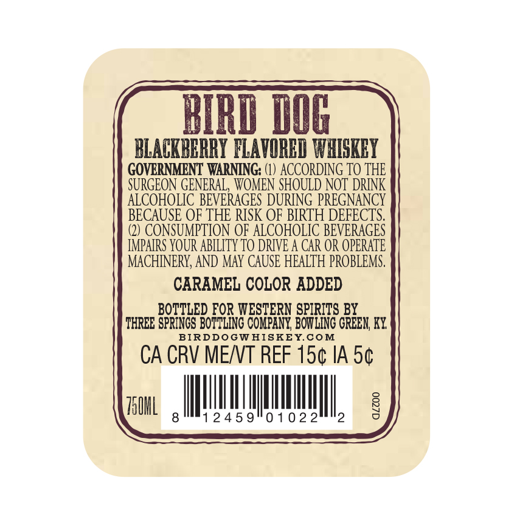

# TTB COLA Label Images - TTBID 26119001000302

**Brand Name:** BIRD DOG

**Issue Date:** 05/06/2026

**Origin Code:** 22

**Product Class/Type:** 149

**Source:** [TTB Public COLA Registry](https://ttbonline.gov/colasonline/viewColaDetails.do?action=publicFormDisplay&ttbid=26119001000302)

## Label Images

### Label 1

### Label 2

## Extracted Label Text

*Text extracted via OCR - may contain errors*

### Label 1

BIRD DOG

BLACK EE RRY

FLAVORED

D9 ALCS/VOL.
TOO ML

### Label 2

MI@ dOG
BLACKBBRRY FLAVORBI WHIGKBY
GOVERNMENT WARNING: (1) ACCORDNNG TO THE
SURGEON GENERAL, WOMEN SHOULD NOT  DRINK
ALCOHOLIC BEVERAGES DURING PREGNANCY
BECAUSE OF THE RISK OF BIRTH DEFECTS.
CONSUMPTION OF ALCOHOLIC BEVERAGES
IMPAIRS YOUR AbILITy TO DRIVE A CAR OR OPERATE
MACHNNERY, AND MAY CAUSE HEALTH PROBLEMS .
CARAMEL COLOR ADDED
BO TLED FOR WESTERN SPIRITS BY
THREE SPRINCS BorTbing COMPANY BowiiNg CREEN KY
BIRDDOGWHISKEYCOM
CA CRV MENT REF 15c IA 5c
750L
8
2 4 5 9
0 1 0 2 2
