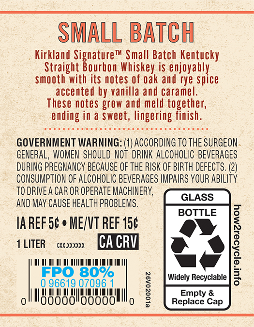
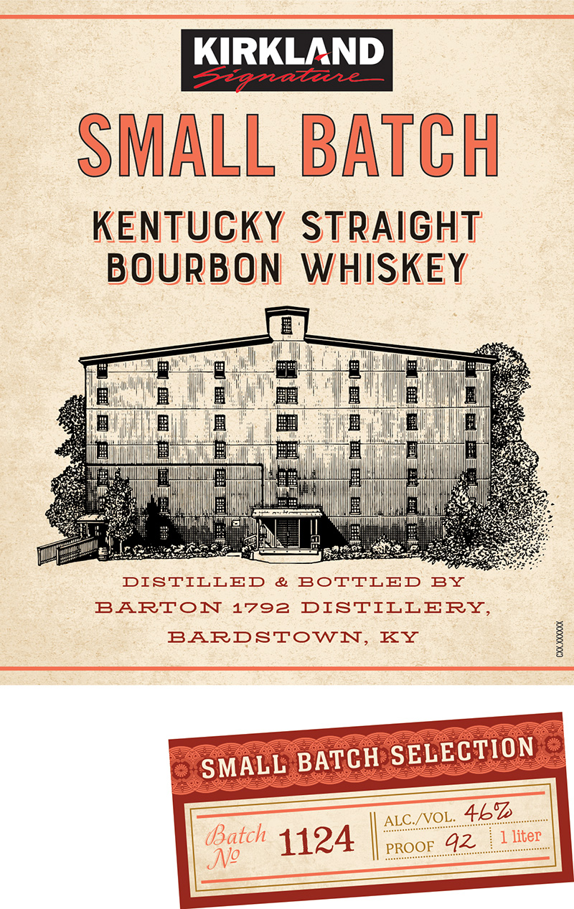
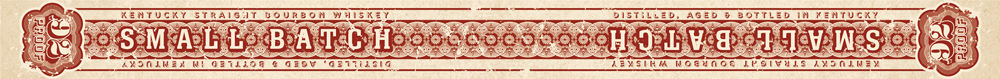

# TTB COLA Label Images - TTBID 26119001000512

**Brand Name:** KIRKLAND SIGNATURE

**Fanciful Name:** SMALL BATCH

**Issue Date:** 05/01/2026

**Origin Code:** 22

**Product Class/Type:** 101

**Source:** [TTB Public COLA Registry](https://ttbonline.gov/colasonline/viewColaDetails.do?action=publicFormDisplay&ttbid=26119001000512)

## Label Images

### Back Label

### Label 1

### Label 3

## Extracted Label Text

*Text extracted via OCR - may contain errors*

**Detected Proof:** 80

### Back Label

SMALL BATCH

Kirkland Signature™ Small Batch Kentucky

Straight Bourhon Whiskey is enjoyabl

smooth with its notes of oak and rye spice

accented by vanilla and caramel.

These notes grow and meld together,

ending in a Sweet, lingering finish

GOVERNMENT WARNING: (1) ACCORDING TO THE SURGEON

GENERAL, WOMEN SHOULD NOT DRINK ALCOHOLIC BEVERAGES

DURING PREGNANCY BECAUSE OF THE RISK OF BIRTH DEFECTS. (2)

CONSUMPTION OF ALCOHOLIC BEVERAGES IMPAIRS YOUR ABILITY

TO DRIVEA CAR OR OPERATE MACHINERY,

AND MAY CAUSE HEALTH PROBLEMS

BOTTLE

IAREF S¢ « ME/VT REF 15¢

ay

TLITER — cxxxnx feat

ut 1p ET

80%

Widely Recyclable

oll

00000

{ il ‘i i i

i!

nit

00000

Ill,

Em

&

Replace Cap

### Label 1

KIRKLAND
9o2d
SMALL BATCH
KENTUCKY STRAIGHT
BOURBON
WHISKEY
E
DISTILLED
&
BoTTLED
BY
BARTON 1792
DISTILLERY
BARDSTOWN,
KY
1
SMALL BATCH SELECTION
ALC /VOL:
4k*
(Batch
1124
PROOF
92
1 liter
Ng

### Label 3

EC) KENTUCKY STRAIGIT BOURBON WHISKET. SaaS — DISTILLED, AGED 8 BOTTLED IN KENTUCKY ln
is « D RES es, Ee Pres i aes = Tr SSS "ye s See a eee eo ee See ee. CP ee FQEDELA <3 a8 q ‘we + 1)
HE ag heros PAs la BeALcOiH aeons My ori v acre | Us NeSend ate |
Se) ee

gs AMOVLNEL WE OF1A19G € GEOW GETTASIG oeahes 2EVSIRM NOGUAOS LUSIVULS AMOMKNEY ba gS?
