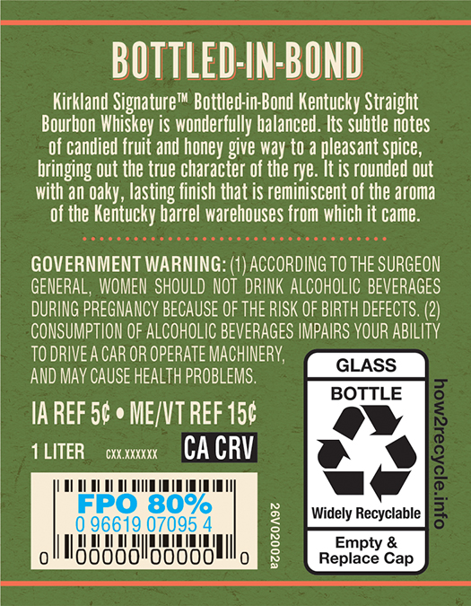
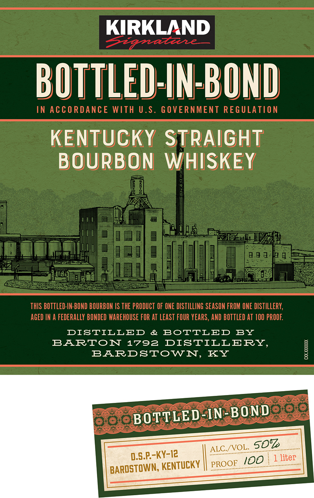
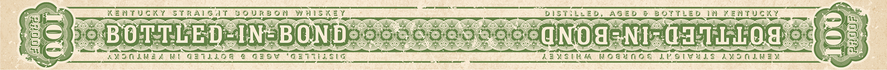

# TTB COLA Label Images - TTBID 26119001000531

**Brand Name:** KIRKLAND SIGNATURE

**Fanciful Name:** BOTTLED IN BOND

**Issue Date:** 05/01/2026

**Origin Code:** 22

**Product Class/Type:** 110

**Source:** [TTB Public COLA Registry](https://ttbonline.gov/colasonline/viewColaDetails.do?action=publicFormDisplay&ttbid=26119001000531)

## Label Images

### Back Label

### Label 1

### Label 3

## Extracted Label Text

*Text extracted via OCR - may contain errors*

**Detected Proof:** 100

### Back Label

BOTTLEd IN BOND
Kirkland Signaturem Bottled in Bond Kentucky Straight
Bourbon Whiskey iS wonderfully balanced . Its Subtle notes
of candied fruit and honey give way to a pleasant spice ,
bringing out the true character of the rye. It is rounded out
with an Oaky , lasting finish that is reminiscent of the aroma
of the Kentucky barrel warehouses from which it came
GOVERNMENT WARNING: ({) ACCORDING TO THE SURGEON
GENERAL, WOMEN  SHOULD NOT DRINK ALCOHOLIC BEVERAGES
DURING PREGNANCY BECAUSE OF THE RISK OF BIRTH DEFECTS.
CONSUMPTION OF ALCOHOLIC BEVERAGES IMPAIRS YOUR AbILITy
TO DRIVEA CAR OR OPERATE MACHINERy;
GLASS
AND May CAUSE HEALTH PROBLEMS.
BOTTLE
IA REF 50 -
MEJVT REF 150
1 LITER
CXX XXXXXX
CA CRV
1
FPO 80%
Widely Recyclable
8
0 96619 07095
188888188888
1
Repiace €
Cap

### Label 1

KIRKLAND
BOTTLED-IN BOND
IN AccORDAncE WITH U.S. GOVERNMENT REGULATION
KENTUCKY STRAIGHT
BOURBON
WHISKEY
THIS BOTTLed-IN-BOND BOURBON /S THE PRODUCT OF ONE DISTILLING SEASON FROM ONE distIllery;
AGED IN A fedERaLLY BONDED WAREHOUSE FOR AT least FOUR YEARS , AND BOTTLED AT 100 PROOF
DISTILLED
&
BoTTLED
BY
BARTON
1792
DISTILLERY,
BARDSTOWN,
KY
1
BOTTLED-IN-BOND
ALC /VOL
507
D.S.P-KY-I2
I00
liter
BAROSTOWN; KENTUCKY
PROOF

### Label 3

a a KENTUCKY STRAIGAT VOURBON WHISKEY. eee bistitued, AGED @ BOTTLED IN KENTUCKY vane
Ve Ine, ee Cn Oty SOD ESIC alee
fe pe BOTTLED) -IN-BONDs 2 o4soe 5 43 ONUGsNIzGd TIL O° 4 at

CS a aes a hire ee oe a
wy AMOMLWEL NI GeiLhOe @ G20v GuTtasiG Sagtaes ZENSINM WOEUHOE LE OIVULS ANOMUNED eg?
