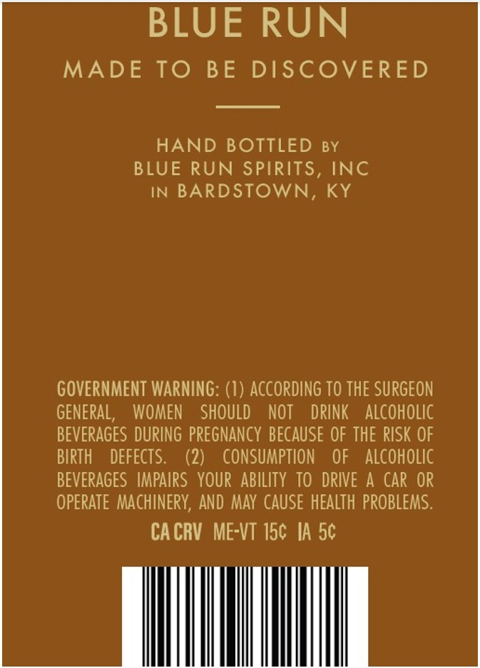

# TTB COLA Label Images - TTBID 26119001000561

**Brand Name:** BLUE RUN

**Issue Date:** 05/01/2026

**Origin Code:** 22

**Product Class/Type:** 101

**Source:** [TTB Public COLA Registry](https://ttbonline.gov/colasonline/viewColaDetails.do?action=publicFormDisplay&ttbid=26119001000561)

## Label Images

### Back Label

## Extracted Label Text

*Text extracted via OCR - may contain errors*

### Back Label

BLUE RUN

MADE TO BE DISCOVERED

HAND BOTTLED sy

BLUE RUN SPIRITS, INC

IN BARDSTOWN, KY

GOVERNMENT WARNING: (1) ACCORDING TO THE SURGEON

GENERAL,

WOMEN SHOULD NOT DRINK ALCOHOLIC

BEVERAGES DURING PREGNANCY BECAUSE OF THE RISK OF

BIRTH DEFECTS.

(2)

CONSUMPTION OF ALCOHOLIC

BEVERAGES IMPAIRS YOUR ABILITY TO DRIVE A CAR OR

OPERATE MACHINERY, AND MAY CAUSE HEALTH PROBLEMS.

CACRV ME-VT 15¢ IA 5¢
