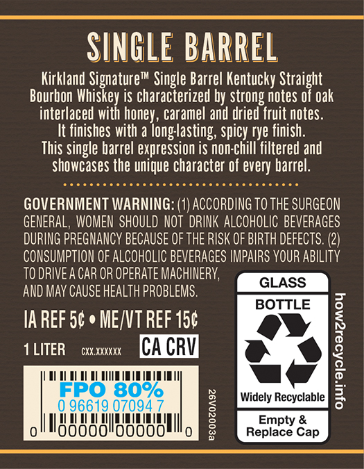
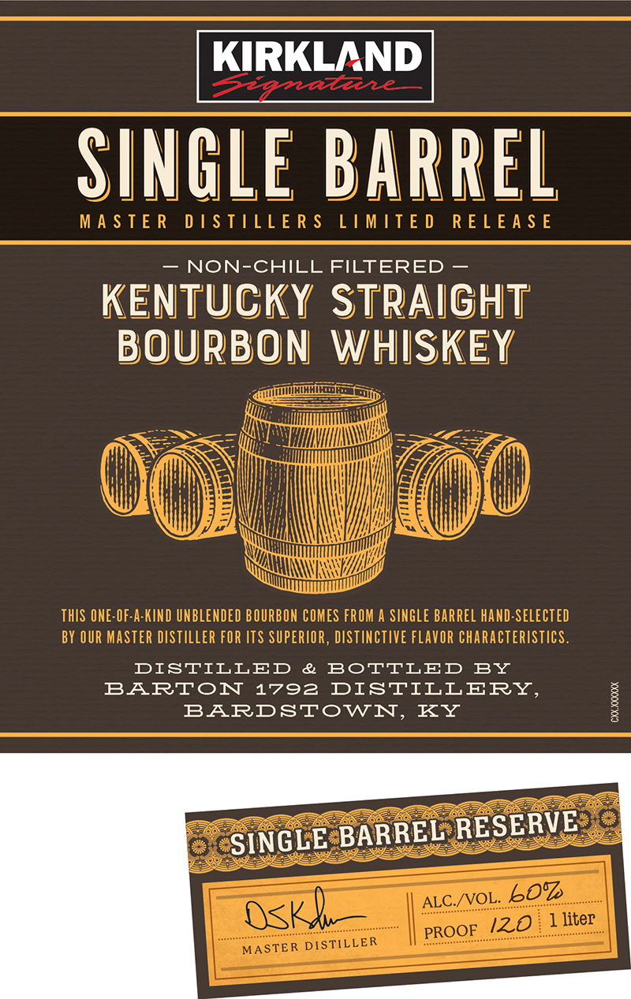
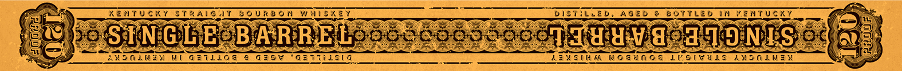

# TTB COLA Label Images - TTBID 26119001000573

**Brand Name:** KIRKLAND SIGNATURE

**Fanciful Name:** SINGLE BARREL

**Issue Date:** 05/01/2026

**Origin Code:** 22

**Product Class/Type:** 101

**Source:** [TTB Public COLA Registry](https://ttbonline.gov/colasonline/viewColaDetails.do?action=publicFormDisplay&ttbid=26119001000573)

## Label Images

### Back Label

### Label 1

### Label 3

## Extracted Label Text

*Text extracted via OCR - may contain errors*

### Back Label

SINGLE BARREl
Kirkland Signaturem Single Barrel Kentucky Straight
Bourbon Whiskey is characterized by strong notes 0f oak
interlaced with
caramel and dried fruit notes.
It finishes with a
spicy rye finish:
This single barrel expression is non-chill filtered and
showcases the unique character of every barrel.
GOVERNMENT WARNING: (1) ACCORDING TO THE SURGEON
GENERAL, WOMEN SHOULD NOT  DRINK ALCOHOLIC BEVERAGES
DURING PREGNANCY BECAUSE OF THE RISK OF BIRTH DEFECTS: (2)
CONSUMPTION OF ALCOHOLIC BEVERAGES IMPAIRS YOUR ABILITy
TO DRIVEA CAR OR OPERATE MAcHINERY;
GLASS
AND May CAUSE HEALTH PROBLEMS.
BOTTLE
IA REF 5c ' ME/VT REF 150
1 LITER
CXX XXXXXX
CA CRV
[
FPO 80%
Widely Recyclable
3
96619 07094
188888198088
1
Repiace Cap
 honey hong tasting ,

### Label 1

KIRKLAND
SINGLE BarREl
M A $ T E R
D ! STILL E R $
LIMITE D
R E L E A $ E
NON-CHILL FILTERED
KENTUCKY STRAigHT
BOURBON
WHISKEY
ThIS ONE-OF-A-KIND UNBLENDED BOURBON COMES FROM A SINGLE Barrel Hand-selected
BY OUR MASTER DISTILLER FOR ITS SUPERIOR, DISTINCTIVE FLAVOR ChaRActeristicS.
DISTILLED
&
BoTTLED
BY
BARTON
1792
DISTILLERY,
BARDSTOWN,
KY

SINGLE BARREL RESERVE
ALC /VOL:
607
OSK
PROOE_122
liter
MASTER DISTILLER

### Label 3

6 KENTUCKY STRAIG IT BOURBON WHISKEY. TES _bistitwep, AGED @ BOTTLED IN VENTUGKY ae

feng) Ea On ee

SW poSTNGUEOBAR RE Los sno co yocol TH uW. ded ONES io3 ane

fe lace! 2 ee re ws et Se SASSER Rebtel WIE ‘O:N Sisk ‘ ae
\ AMoLWEy NU GEIL;Og € G20V “Gaiiiasia Cae ZENSINM NOGUNOA LEOIWHES AMONLNEY
