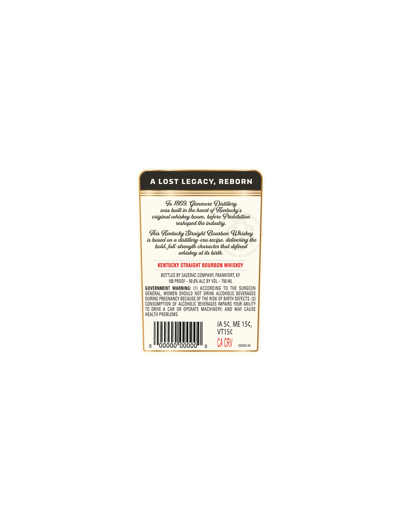
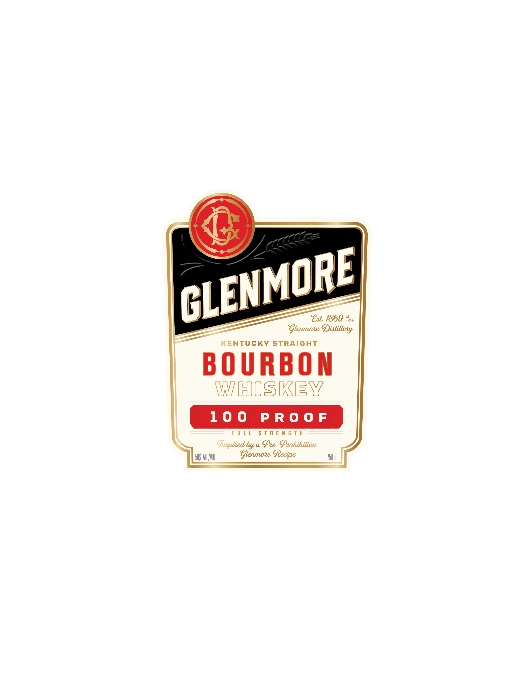

# TTB COLA Label Images - TTBID 26119001000637

**Brand Name:** GLENMORE

**Issue Date:** 05/01/2026

**Origin Code:** 22

**Product Class/Type:** 101

**Source:** [TTB Public COLA Registry](https://ttbonline.gov/colasonline/viewColaDetails.do?action=publicFormDisplay&ttbid=26119001000637)

## Label Images

### Back Label

### Front Label

## Extracted Label Text

*Text extracted via OCR - may contain errors*

**Detected Proof:** 100

### Back Label

A LOst LECACY, REBORN
In /869,Gtenmone Distillew
wad huilt in the heat ofe
Gentuckya
Qiginal
booms hefone Ghohihition
neshaped the industlyr
Ghis %entucky Jhaight Boubon (Uhiskey
i hased on &
eha
hecipe, delivening the
bolds fulb-abhength characten thab defined
at ita hith.
KENTUCKY STRAIGHT BOURBON WHISKEY
BOTTLED BY SAZERAC COMPANY, FRANKFORT; KY
100 PROOF
50.0% ALC BY VOL ~ 750 ML
GOVERNMENT  WARNING: (1| ACCORDING TO THE  SURGEON
GENERAL, WOMEN SHOULD NOT  DRINK ALCOHOLIC BEVERAGES
DURING PREGNANCY BECAUSE OF THE RISK OF BIRTH DEFECTS. (2)
CONSUMPTION OF ALCOHOLIC BEVERAGES IMPAIRS YOUR ABILITY
TO DRIVE A CAR OR OPERATE  MACHINERY, AND MAY CAUSE
HEALTH PROBLEMS,
IA 5c, ME 156,
VTISc
ooooC
0
Ca CRV
XXXXXX-XX
whiskey "
distillejyy
whidkey -

### Front Label

=~)

LENMORE

= Glenmore Distillew

CENTUCKY STRAIGHT

WY Tal STKE W/

FULL STRENGTH
hapired by a Pre- Prohibition
54 ACI Glenmore Recipe il
