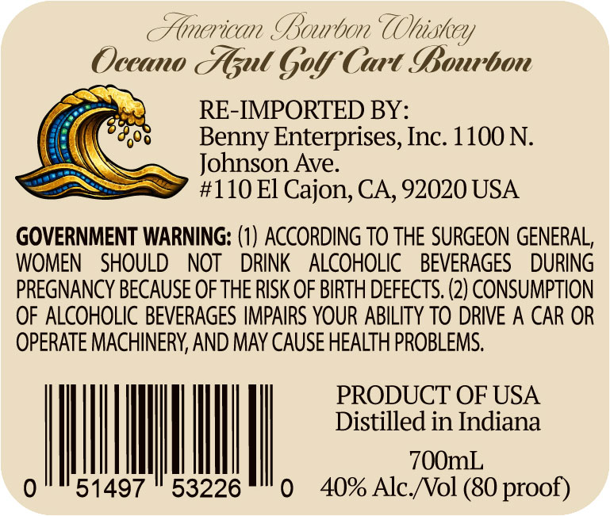
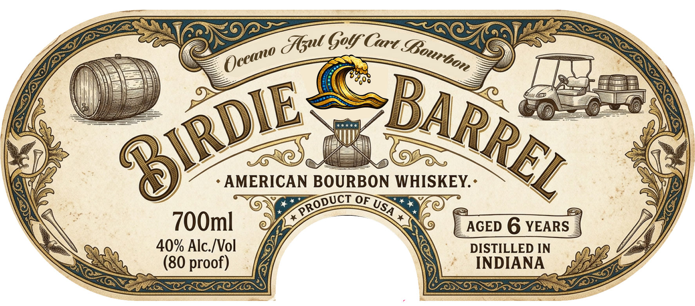

# TTB COLA Label Images - TTBID 26119001000640

**Brand Name:** OCEANO AZUL

**Fanciful Name:** GOLF CART BOURBON

**Issue Date:** 05/06/2026

**Origin Code:** 00

**Product Class/Type:** 141

**Source:** [TTB Public COLA Registry](https://ttbonline.gov/colasonline/viewColaDetails.do?action=publicFormDisplay&ttbid=26119001000640)

## Label Images

### Back Label

### Front Label

## Extracted Label Text

*Text extracted via OCR - may contain errors*

**Detected Proof:** 80
**Detected Age:** 6 Years

### Back Label

Fmnerican Sowrbon UOhiskey
Oceano Esut Goy Curt SBonrbon
RE-IMPORTED BY:
Benny Enterprises, Inc: 1100 N.
Johnson Ave:
#110 El Cajon, CA, 92020 USA
GOVERNMENT WARNING: (1) ACCORDING TO THE SURGEON GENERAL,
WOMEN
SHOULD
NOT
DRINK
ALCOHOLIC
BEVERAGES
DURING
PREGNANCY BECAUSE OF THE RISK OF BIRTH DEFECTS, (2) CONSUMPTION
OF ALCOHOLIC BEVERAGES IMPAIRS YOUR ABILITY TO DRIVE A CAR OR
OPERATE MACHINERY; AND MAY CAUSE HEALTH PROBLEMS:
PRODUCT OF USA
Distilled in Indiana
70OmL
51497
53226
40% AlcNol (80 proof)

### Front Label

{qul Gol Cart .
AMERICAN BOURBON WHISKEY: -
OF
700m]
AGED 6 YEARS
40% Alc NVol
DISTILLED IN
(80 proof)
INDIANA
BBourbon
Oceano
BARREL
S1RDIE
PRODUCT
USA
