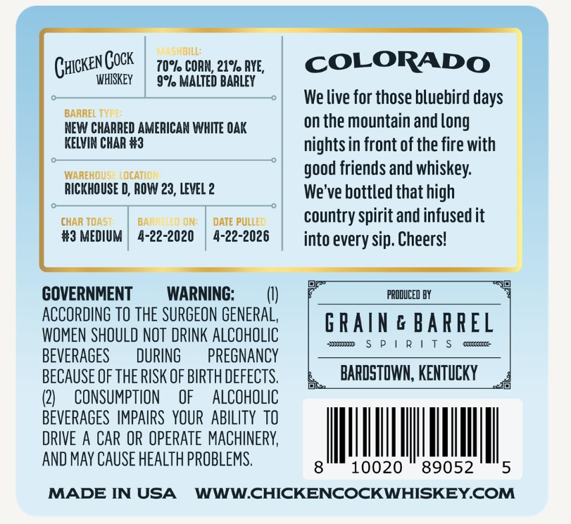
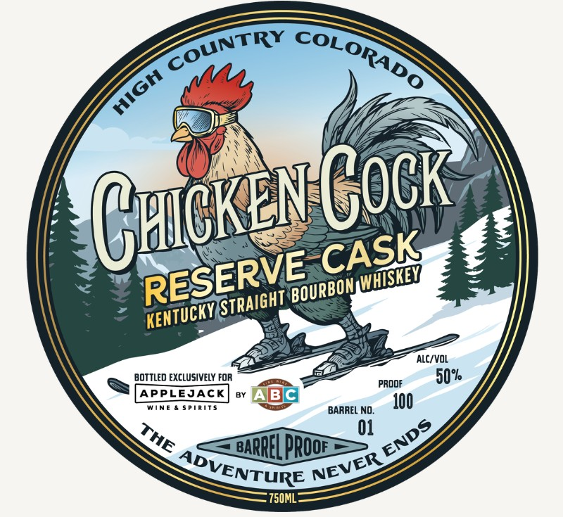

# TTB COLA Label Images - TTBID 26119001000645

**Brand Name:** CHICKEN COCK

**Issue Date:** 05/01/2026

**Origin Code:** 22

**Product Class/Type:** 101

**Source:** [TTB Public COLA Registry](https://ttbonline.gov/colasonline/viewColaDetails.do?action=publicFormDisplay&ttbid=26119001000645)

## Label Images

### Back Label

### Front Label

## Extracted Label Text

*Text extracted via OCR - may contain errors*

**Detected Proof:** 100

### Back Label

CHcKENCOCK | 70, conn 21% AYE

WHISKEY

COLORADO

9°% MALTED BARLEY

We live for those bluebird days

NEW CHARRED AMERICAN WHITE OAK

on the mountain and long

KELVIN CHAR #3

nights in front of the fire with

RICKHOUSE D “ROW 23, LEVEL 2

HOUS

good friends and whiskey.

We've bottled that high

CHAR TOAS)

BAR

ON:

DATE PULLEC

country spirit and infused it

#3 MEDIUM | 4- 22 -2020 | 4-22-2026

into every sip. Cheers!

GOVERNMENT

WARNING

(I

PRODUCED BY

ACCORDING TO THE SURGEON GENERAL,

GRAIN & BARREL

WOMEN SHOULD NOT DRINK ALCOHOLIC

vem SPIRIT S cme

BEVERAGES

DURING

PREGNANCY

BECAUSE OF THE RISK OF BIRTH DEFECTS

BARDSTOWN, KENTUCKY

isl

2)

CONSUMPTION OF ALCOHOLIC

BEVERAGES IMPAIRS YOUR ABILITY TO

DRIVE A CAR OR OPERATE MACHINERY,

AND MAY CAUSE HEALTH PROBLEMS

|

ll

NIM

|

MADE IN USA WWW.CHICKENCOCKWHISKEY.COM

### Front Label

Cruoke Cock
ALC/VOL
BOTTLED EXCLUSIVELY FOR
50%
PRDOF
APPLEJACK
BC
WIne
S PRiTS
BARREL NO_
100
01
BARREL prOoe
'750ML"
COUNTRY
COLORADO
miGH
CASK
RESERVE
WHISKEY
BOURBON
STRAIGHT
KENTUCKYE
ENDS
THE
ADVENTURE
NEVER
