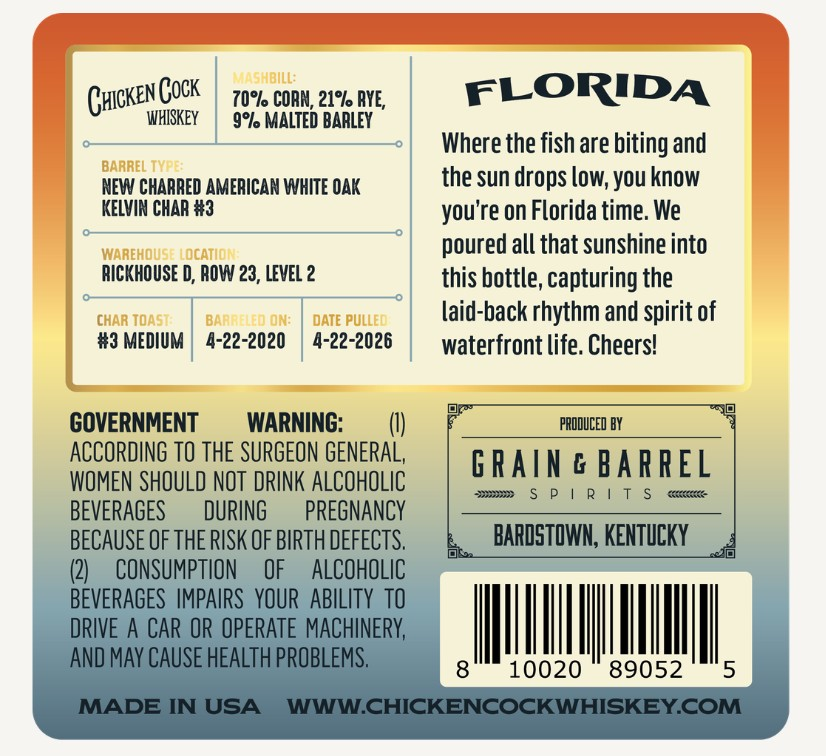

# TTB COLA Label Images - TTBID 26119001000650

**Brand Name:** CHICKEN COCK

**Issue Date:** 05/01/2026

**Origin Code:** 22

**Product Class/Type:** 101

**Source:** [TTB Public COLA Registry](https://ttbonline.gov/colasonline/viewColaDetails.do?action=publicFormDisplay&ttbid=26119001000650)

## Label Images

### Front Label

## Extracted Label Text

*Text extracted via OCR - may contain errors*

### Front Label

14 shbill:
Chcken Gock
70%l CORH; 21% RYE,
FLORIDA
WHISKEY
9% MALTED BARLEY
Where the fish are biting and
BARREL T
NEW CHARRED AMERICAN WHITE OAK
the sun drops low; you know
KELVIN CHAR #3
you're on Florida time. We
WAREHOUSE LOCATION
poured all that sunshine into
RICKHOUSE D, ROW 23, LEVEL 2
this bottle; capturing the
chaR Toas
BARRFLEO ON:
DATE PULLE
laid-back rhythm and spirit of
#3 MEDIUM
4-22-2020
4-22-2026
waterfront life: Cheers!
GOVERNMENT
WARNING:
PRODUCED BY
ACCORDING TO ThE SURGEON GENERAL,
GRAIN & BARREL
WOMEN SHOULD NOT DRINK ALCOHOLIC
4
P |
R | T $
8
BEVERAGES
DURING
PREGNANCY
BECAUSE OF THE RISK OF BIRTH DeFECTS;
BARDSTOWN, KENTUCKY
(2)
CONSUMPTION
OF
ALCOHOLIC
BEVERAGES IMPAIRS   YOUR  AbilITY TO
DRIVE A CAR OR OPERATE MACHINERY,
AND MAY CAUSE HEALTH PROBLEMS.
10020
89052
5
MADE IN USA
WWWCHICKENCOCKWHISKEYCOM
