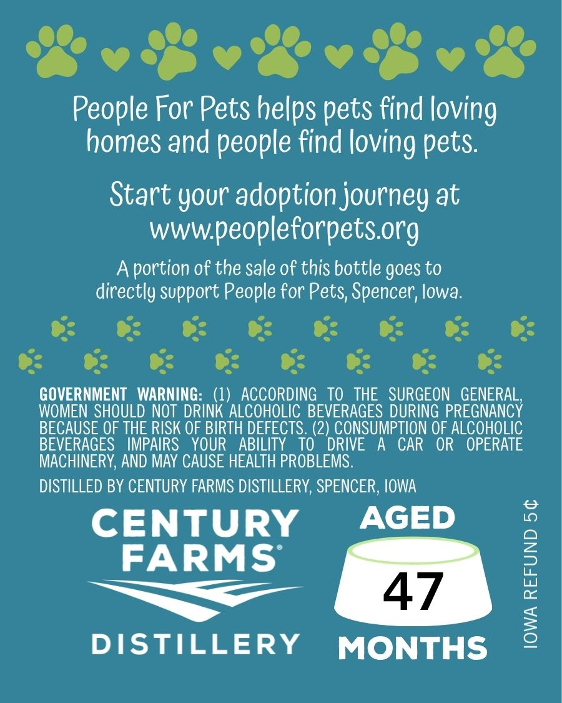
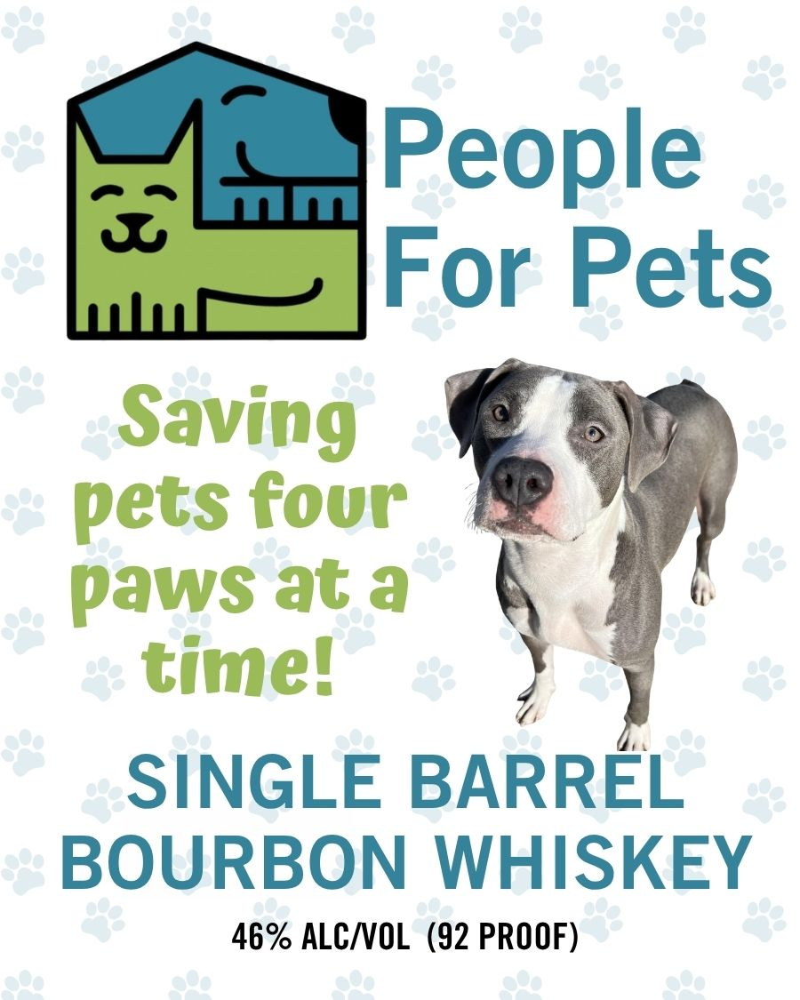

# TTB COLA Label Images - TTBID 26119001000807

**Brand Name:** PEOPLE FOR PETS

**Issue Date:** 05/01/2026

**Origin Code:** 20

**Product Class/Type:** 141

**Source:** [TTB Public COLA Registry](https://ttbonline.gov/colasonline/viewColaDetails.do?action=publicFormDisplay&ttbid=26119001000807)

## Label Images

### Back Label

### Front Label

## Extracted Label Text

*Text extracted via OCR - may contain errors*

**Detected Proof:** 92

### Back Label

People For Pets helps
find loving
homes and people find
pets:
Start your adoption journey at
wwwpeopleforpetsorg
portion of the sale of this bottle goes to
directly support People for Pets; Spencer; lowa:
GOVERNMENT   WARNING:   (1)   ACCORDING   TO   THE   SURGEON   GENERAL,
WOMEN  SHOULD NOT  DRINK ALCOHOLIC BEVERAGES DURING PREGNANCY
BECAUSE OF THE RISK OF BIRTH DEFECTS. (2) CONSUMPTION OF ALCOHOLIC
BEVERAGES
IMPAIRS
YOUR
ABILITY
TO
DRIVE
A
CAR
OR
OPERATE
MACHINERY, AND May CAUSE HEALTH PROBLEMS.
DISTILLED BY CENTURY FARMS DISTILLERY, SPENCER , IOWA
CENTURY
AGED
9
FARMS
2
47
DISTILLERY
MONTHS
2
pets
loving

### Front Label

People
3
For Pets
Saving
pets four
paws at a
timel
SINGLE BARREL
BOURBON WHISKEY
46% ALCIOL (92 PROOF)
