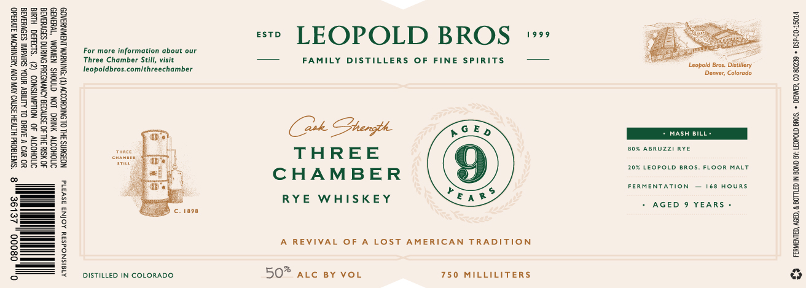

# TTB COLA Label Images - TTBID 26119001000828

**Brand Name:** LEOPOLD BROS.

**Fanciful Name:** THREE CHAMBER

**Issue Date:** 05/04/2026

**Origin Code:** 13

**Product Class/Type:** 112

**Source:** [TTB Public COLA Registry](https://ttbonline.gov/colasonline/viewColaDetails.do?action=publicFormDisplay&ttbid=26119001000828)

## Label Images

### Label 1

## Extracted Label Text

*Text extracted via OCR - may contain errors*

**Detected Age:** 9 Years

### Label 1

‘SMOHOOTY NIG LON GTNOHS N3WOM “WuINID

YO UVD V 3ARG OL ALB UNDA SUIvAIN! SBOVUATE
‘OMOHOTY 40 NOUdWNSNOO (2) “SLOG Hive
40 YSIY 3H 30 3STV03 AONVNORRd ONIUNG S29VAA3E
‘NOBOWNS 3H. OL DNIGYODON (F) “ONIN JNBAINREADD

08000 » ZELOE gu 8 “SWTTGOUd HIGH ISNVO AVN ONY ‘AENIHOVIN IVR

AlaISNOdS3Y AOINA aSvaTE

For more information about our
Three Chamber Still, visit
teopoldbros.com/threechamber

DISTILLED IN COLORADO

«° LEOPOLD BROS +

—— ___ FAMILY DISTILLERS OF FINE SPIRITS = ——

(Ak Phargbh
THREE
CHAMBER
RYE WHISKEY

SED

A REVIVAL OF A LOST AMERICAN TRADITION

50? atc sy vor

750 MILLILITERS

Leopold Bros. Distitery
Denver, Colorado

80% ABRUZZI RYE
20% LEOPOLD BROS. FLOOR MALT
FERMENTATION — 168 HOURS.

+ AGED 9 YEARS +

£2 Ferwene,aceD,« BOTTLED IN BOND Ay: LEOPOLD BROS. + DEAVER, CO 80239 + DsP-Co.15014
