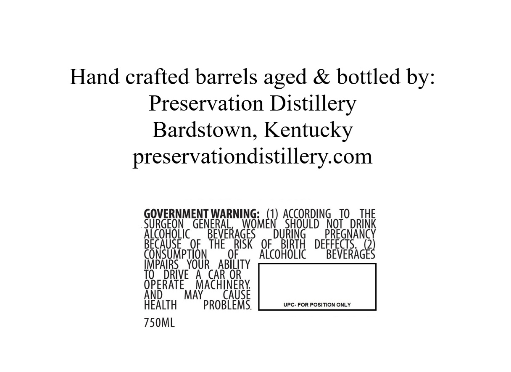
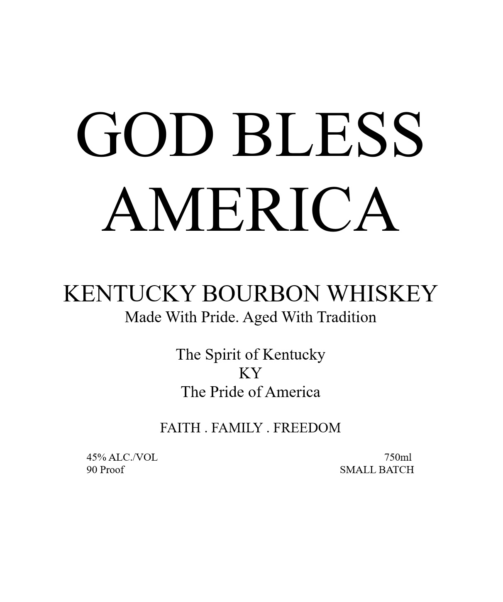

# TTB COLA Label Images - TTBID 26119001000926

**Brand Name:** GOD BLESS AMERICA

**Issue Date:** 05/04/2026

**Origin Code:** 22

**Product Class/Type:** 141

**Source:** [TTB Public COLA Registry](https://ttbonline.gov/colasonline/viewColaDetails.do?action=publicFormDisplay&ttbid=26119001000926)

## Label Images

### Back Label

### Label 1

## Extracted Label Text

*Text extracted via OCR - may contain errors*

**Detected Proof:** 90

### Back Label

Hand crafted barrels aged & bottled by:
Preservation Distillery
Bardstown, Kentucky
preservationdistillery.com
GOVERNMENT WARNING:
INGme8)  AGORBIG
TO
THE
SURGEON
GENERAL
SHOuLd " Not ^ DRINK
HEeSugekc9
BEVERAGES
DURING
PREGNANCY
QF   THE
RISK
OF
BIRTH
DEFFECTS:
consuMption
OF
ALcoHoLic
BEVERAGES
IMPAIRS
YOUR
ABILITY
TO
DRLVE
A
CAR O
Qperate
MAY
Aachghey
HEALTH
PROBLEMS.
UPC- FOR POSITION ONLY
750ML

### Label 1

GOD BLESS
AMERICA
KENTUCKY BOURBON WHISKEY
Made With Pride. Aged With Tradition
The Spirit of Kentucky
KY
The Pride of America
FAITH
FAMILY
FREEDOM
45% ALC NOL
750ml
90 Proof
SMALL BATCH
