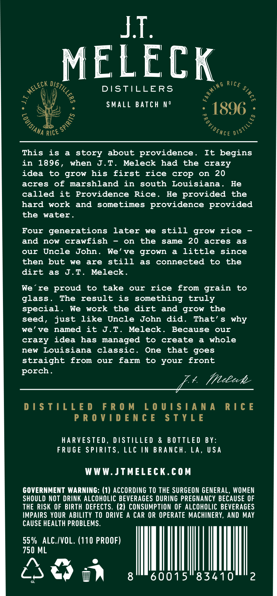
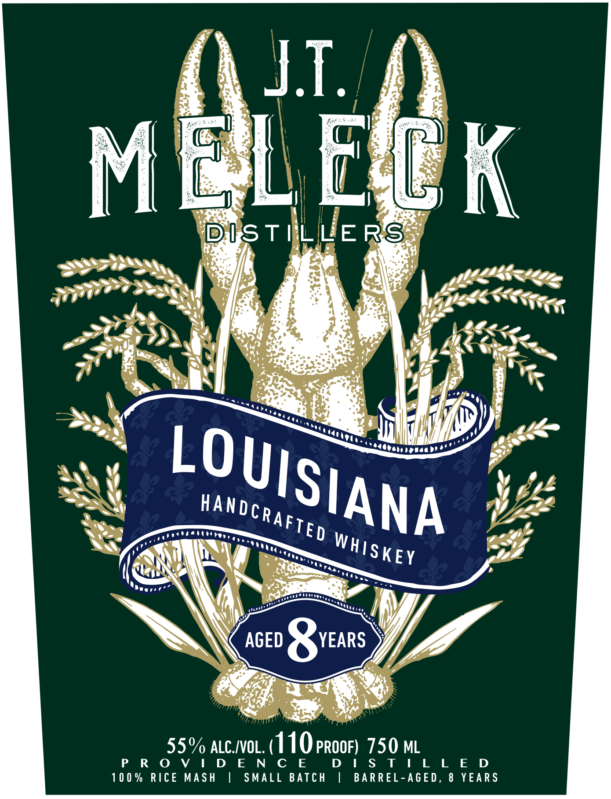
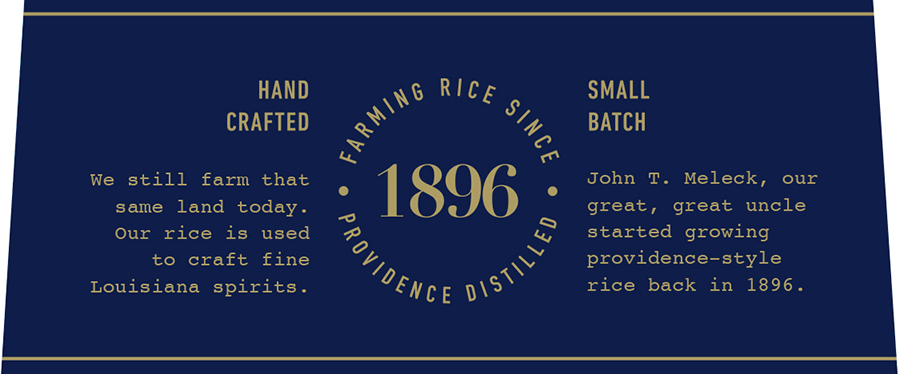
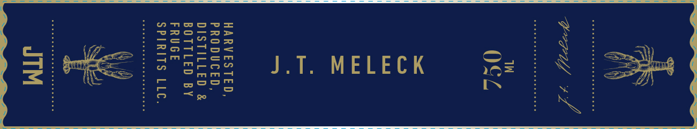

# TTB COLA Label Images - TTBID 26120001000258

**Brand Name:** J.T. MELECK DISTILLERS

**Issue Date:** 05/04/2026

**Origin Code:** 23

**Product Class/Type:** 140

**Source:** [TTB Public COLA Registry](https://ttbonline.gov/colasonline/viewColaDetails.do?action=publicFormDisplay&ttbid=26120001000258)

## Label Images

### Back Label

### Front Label

### Label 3

### Label 4

## Extracted Label Text

*Text extracted via OCR - may contain errors*

*1 image(s) excluded: text did not meet readability threshold*

**Detected Proof:** 110

### Back Label

MELECK

Rue

«et Be

DISTILLERS

SMALL BATCH N°

"1896 :

ANA RICE?

“eng —

This is a story about providence

It begins

in 1896, when J.T. Meleck had the crazy

idea to grow his first rice crop on 20

acres of marshland in south Louisiana. He

called it Providence Rice

He provided the

hard work and sometimes providence provided

the water

Four generations later we still grow rice —

and now crawfish - on the same 20 acres as

our Uncle John. We’ve grown a little since

then but we are still as connected to the

dirt as J.T. Meleck

Were proud to take our rice from grain to

glass

The result is something truly

special. We work the dirt and grow the

seed

just like Uncle John did. That’s why

we’ve named it J.T. Meleck. Because our

crazy idea has managed to create a whole

new Louisiana classic

One that goes

straight from our farm to your front

porch

flelecke

ee eae

DISTILLED FROM LOUISIANA RICE

PROVIDENCE STYLE

HARVESTED, DISTILLED & BOTTLED BY

FRUGE SPIRITS, LLC IN BRANCH. LA, USA

WWW.JTMELECK.COM

GOVERNMENT WARNING: (1) ACCORDING TO THE SURGEON GENERAL, WOMEN

SHOULD NOT DRINK ALCOHOLIC BEVERAGES DURING PREGNANCY BECAUSE OF

THE RISK OF BIRTH DEFECTS. (2) CONSUMPTION OF ALCOHOLIC BEVERAGES

IMPAIRS YOUR ABILITY TO DRIVE A CAR OR OPERATE MACHINERY, AND MAY

CAUSE HEALTH PROBLEMS.

55% ALC./VOL. (110 PROOF)

x ML

>,

1

oN eo at

I

60015 8341

### Label 3

HAND
SMALL
CRAFTED
BATCH
We
still
farm that
John
T .
Meleck,
our
same
land today _
1896
great , great
uncle
Our
rice
is
used
started growing
to
craft
fine
providence-style
Louisiana spirits _
rice
back
in
1896 _
RIcE
FaRming
1
"RovidENc€
dISTIL'

### Label 4

aoesece Pop
Cal ie Fee = o, 3 iad
SJ eee P5EES LT. MELECK «© Sez Sg
