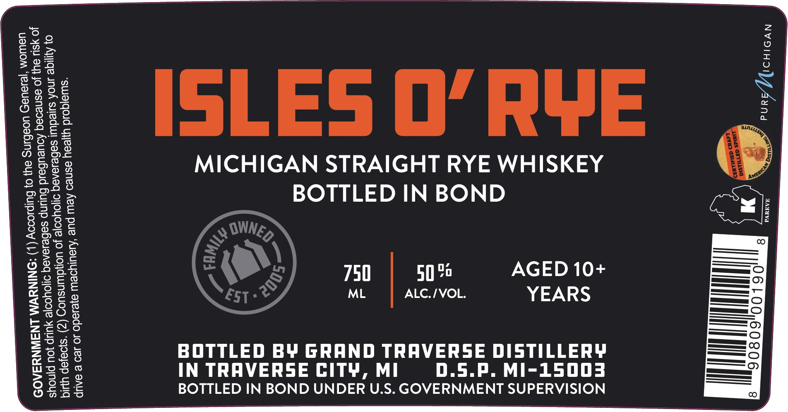

# TTB COLA Label Images - TTBID 26120001000414

**Brand Name:** GRAND TRAVERSE DISTILLERY

**Fanciful Name:** ISLES O' RYE 10+ YEAR

**Issue Date:** 05/04/2026

**Origin Code:** 06

**Product Class/Type:** 112

**Source:** [TTB Public COLA Registry](https://ttbonline.gov/colasonline/viewColaDetails.do?action=publicFormDisplay&ttbid=26120001000414)

## Label Images

### Back Label

### Label 1

## Extracted Label Text

*Text extracted via OCR - may contain errors*

**Detected Proof:** 100

### Back Label

our story
grew up on a
family farm in
One day, in
the hayloft, I discovered three well-used whiskey jugs.
a
Polish immigrant, was putting
to
use: Fast forward to 2005. We
Grand Traverse Distillery, Northern Michigan s first
craft
We use only local
We distill
and bottle every spirit we sell: No shortcuts:
Grandpa George would be proud
Na zdrowie,
Kent Qabis
Michigan: '
Grandpa
George; '
opened
grain
good
distillery:
grains:

### Label 1

~<eo TN

AGED 10+
YEARS
D.5.P. MI-1L5003

50%
ALC./VOL.

750
ML

BOTTLED IN BOND

MICHIGAN STRAIGHT RYE WHISKEY

BOTTLED BY GRAND TRAVERSE DISTILLERY
BOTTLED IN BOND UNDER U.S. GOVERNMENT SUPERVISION

IN TRAVERSE CIT¥, MI

yoru eyerado 0 129 & SAUP

oid uyyeau esneo Aew pue ‘ueul
0} Ayyige nok Soe S10uor 4 eae eG en Lae
Ie 99q AoueuGeid Buunp si |
“uote voting au} 0} Bulpsoooy (1) -NINSWM cilia
