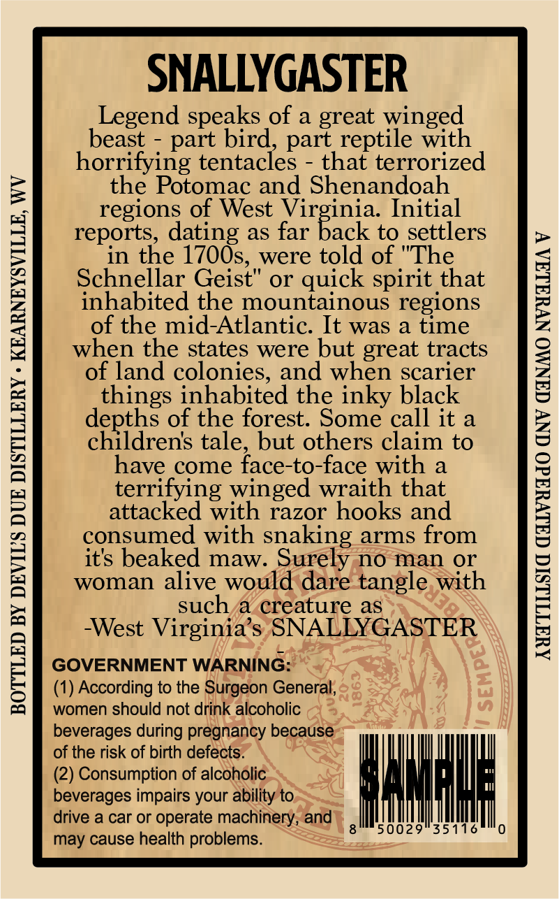
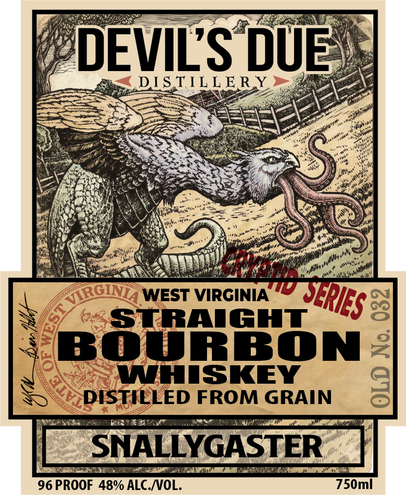
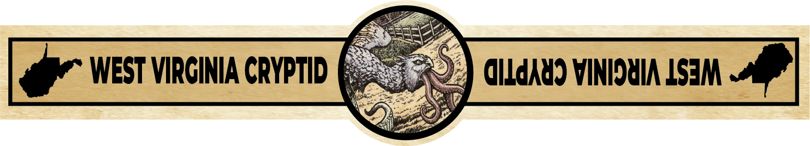

# TTB COLA Label Images - TTBID 26120001000642

**Brand Name:** DEVIL'S DUE DISTILLERY

**Fanciful Name:** WEST VIRGINIA CRYPTID SERIES - SNALLYGASTER

**Issue Date:** 05/06/2026

**Origin Code:** 47

**Product Class/Type:** 101

**Source:** [TTB Public COLA Registry](https://ttbonline.gov/colasonline/viewColaDetails.do?action=publicFormDisplay&ttbid=26120001000642)

## Label Images

### Back Label

### Front Label

### Label 3

## Extracted Label Text

*Text extracted via OCR - may contain errors*

**Detected Proof:** 96

### Back Label

SNALLYGASTER

Legend speaks of a great winged
beast - part bird, part reptile with
horrifying tentacles - that terrorized
the Potomac and Shenandoah
regions of West Virginia. Initial
reports, dating as far back to settlers
in the 1700s, were told of "The
Schnellar Geist" or quick spirit that
inhabited the mountainous regions
of the mid-Atlantic. It was a time
when the states were but great tracts
of land colonies, and when scarier
things inhabited the inky black
depths of the forest. Some call it a
children’s tale, but others claim to
have come face-to-face with a
terrifying winged wraith that
attacked with razor hooks and
consumed with snaking arms from
it's beaked maw. Surely no man or
woman alive would dare tangle, with
such/a creature as
-West Virginia’s SNALLYGASTER

GOVERNMENT WARNING:

(1) According to the Surgeon General,
women should not drink alcoholic
beverages during pregnancy because

of the risk of birth defects.
(2) Consumption of alcoholic
beverages impairs your ability to.
gm50029'35116"0

drive a car or operate machinery, and
may cause health problems.

BOTTLED BY DEVIL'S DUE DISTILLERY » KEARNEYSVILLE, WV

AWATILLSIC GALVYAdO CNV GANMO NVYALAA V

### Front Label

PDEVILS DUES
‘a aes
N ay, : CE Ore
2e =: Teer =
x) FRO ee ; Pa cae a
ee ee ee PY
hea 3 Bien pres gh ges NG CE ie
MSN ie A
RR TS oo eee
4 WEST VIRGINIA EP),
=) STRAIGHT =
BOURBON
R, WHISKEY :
SS “DISTILLED FROMGRAIN &
RULE We SRS BAT LE lO
96 PROOF 48% ALC./VOL. 750ml

### Label 3

WEST VIRCINIA CRYPTID
dILdAU) VINIDHIA LSEJM
