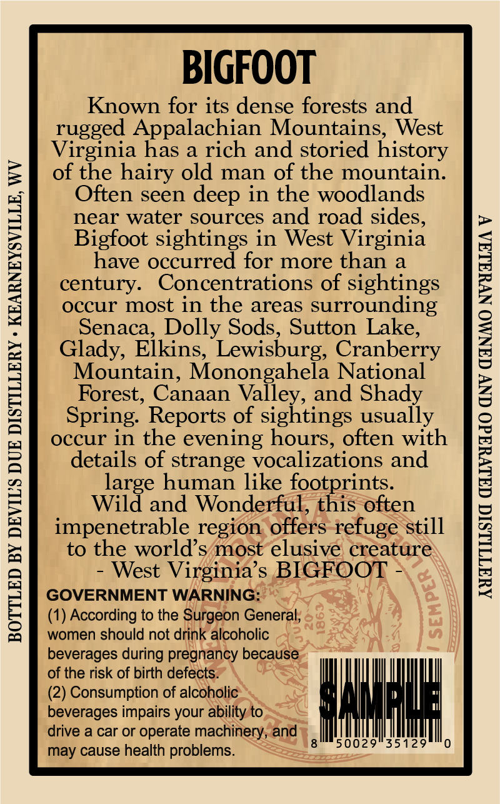
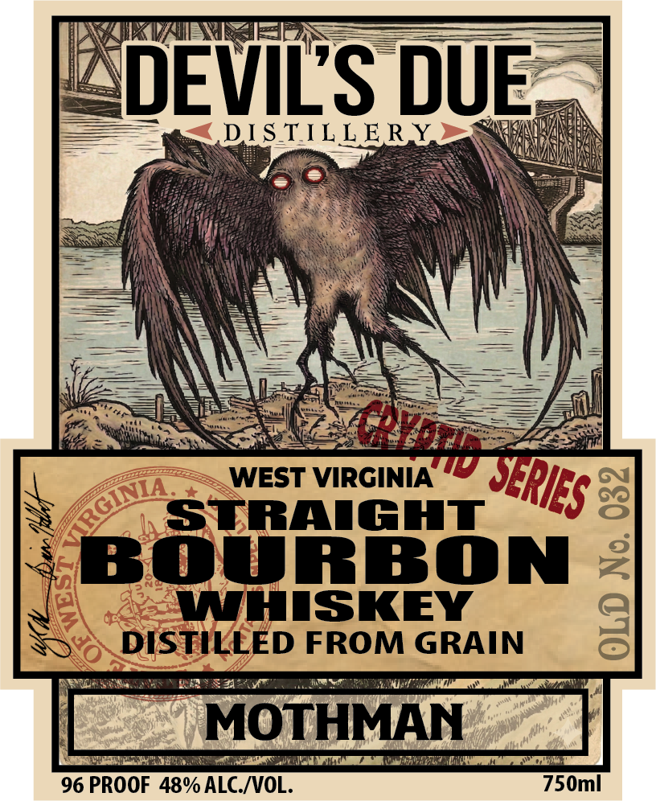

# TTB COLA Label Images - TTBID 26120001000646

**Brand Name:** DEVIL'S DUE DISTILLERY

**Fanciful Name:** WEST VIRGINIA CRYPTID SERIES - MOTHMAN

**Issue Date:** 05/06/2026

**Origin Code:** 47

**Product Class/Type:** 101

**Source:** [TTB Public COLA Registry](https://ttbonline.gov/colasonline/viewColaDetails.do?action=publicFormDisplay&ttbid=26120001000646)

## Label Images

### Back Label

### Front Label

### Label 3

## Extracted Label Text

*Text extracted via OCR - may contain errors*

**Detected Proof:** 96

### Back Label

BIGFOOT

Known for its dense forests and

rugged Appalachian Mountains, West

Virginia has a rich and storied history

of the hairy old man of the mountain.

Often seen deep in the woodlands

near water sources and road sides

Bigfoot sightings in West Virginia

have occurred for more than a

century. Concentrations of sightings

occur most in the areas surrounding

Senaca, Dolly Sods, Sutton Lake

Glady, Elkins, Lewisburg, Cranberry

Mountain, Monongahela National

Forest, Canaan Valley, and Shady

Spring. Reports of sightings usually

occur in the evening hours, often with

details of strange vocalizations and

4

large human like footprints

Wild and Wonderful, this often

impenetrable region offers-refuge still

to the world’s/most elusive creature

- West Virginia’s BIGFOOT -

GOVERNMENT WARNING

(1) According to the Surgeon General.

women should not drink alcoholic

beverages during pregnancy because

of the risk of birth defects.

(2) Consumption of alcoholic

beverages impairs your ability to

drive a car or operate machinery, and

sid

may cause health problems

### Front Label

DEVILS DUE
DLS TILLERY
WEST VIRGINIA
LStradghT
8
BOURBON
4
WHIISKEY
8
DISTILLED FROM GRAIN
MOTHMAN
96 PROOF 48% ALC_ /VOL.
750ml
G
SRIES
GINA

### Label 3

WEST VIRCINIA CRYPTID
dILdAU) VINIDHIA LSEJM
