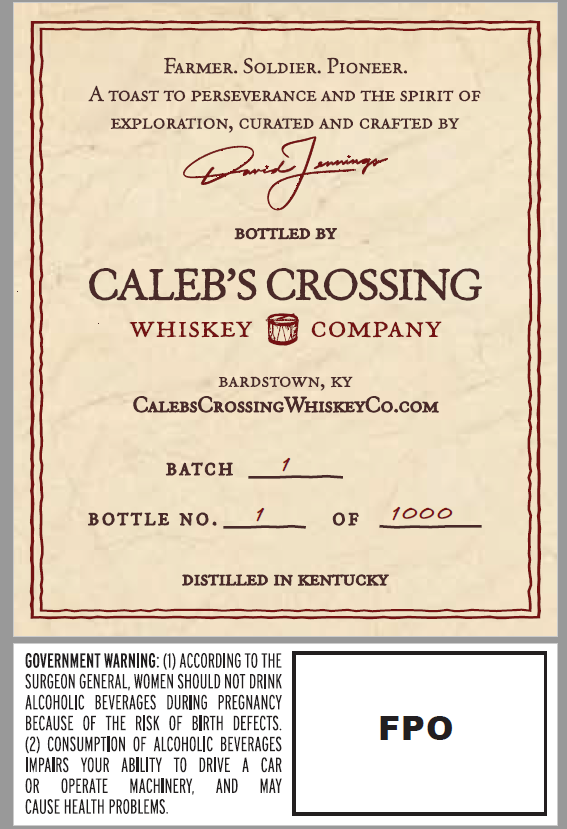
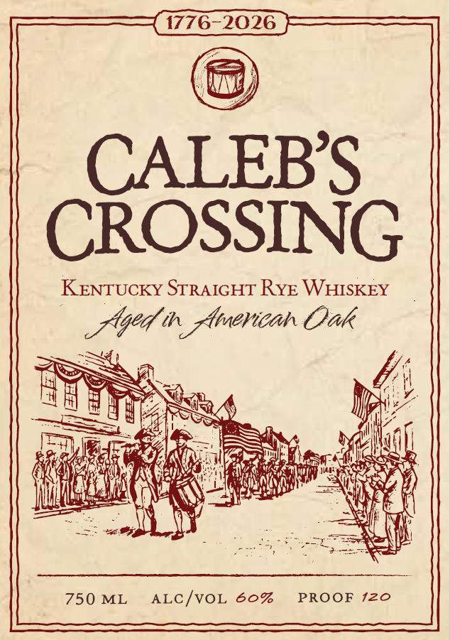
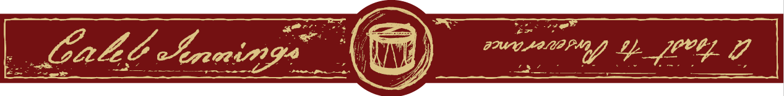

# TTB COLA Label Images - TTBID 26120001000712

**Brand Name:** CALEB'S CROSSING

**Issue Date:** 05/13/2026

**Origin Code:** 22

**Product Class/Type:** 102

**Source:** [TTB Public COLA Registry](https://ttbonline.gov/colasonline/viewColaDetails.do?action=publicFormDisplay&ttbid=26120001000712)

## Label Images

### Back Label

### Label 1

### Label 2

## Extracted Label Text

*Text extracted via OCR - may contain errors*

*1 image(s) excluded: text did not meet readability threshold*

**Detected Proof:** 120

### Back Label

FARMER. SOLDIER. PIONEER.
A TOAST TO PERSEVERANCE AND THE SPIRIT OF
EXPLORATION, CURATED AND CRAFTED BY
BOTTLED BY
CALEBS CROSSING
WHISKEY
COMPANY
BARDSTOWN, KY
CALEBSCROSSINGWHISKEYCO.COM
BATCH
BOTTLE NO.
OF
i000
DISTILLED IN KENTUCKY
GOVERNMENT WARNING: (V) ACCORDING TO THE
SURGEON GENERAL, WOMEN SHOULD NOT DRINK
ALCOHOLIC  beverages   DURING   PREGNANCY
becauSe   OF   THE  RISK   OF   BIRTH   DEFECTS.
FPO
CONSUMPTLON  oF  ALCOHOLIC  beverages
Impalrs   YOUR   ABILITY   to   DRIVE
CAR
OperATe
MAChineRy;
AND
May
CAUSE HEALTH pROBLEMS.

### Label 1

CALEB’S
Kentucky STRAIGHT RYE WHISKEY
LGM br Vicar Oak
ee L e
aS Ne VA
BER AS Mp7
ES SSO (Za
ere ety. wel
ES REEAS © CANE Lil late 2 Baa fl eae
ap rth age cgaae Mi a? ey y)
tu git as Wet ee hd
fae Bh ae Sir
a ey are ky Raat SA
750ML ALC/VOL 60% PROOF 120
