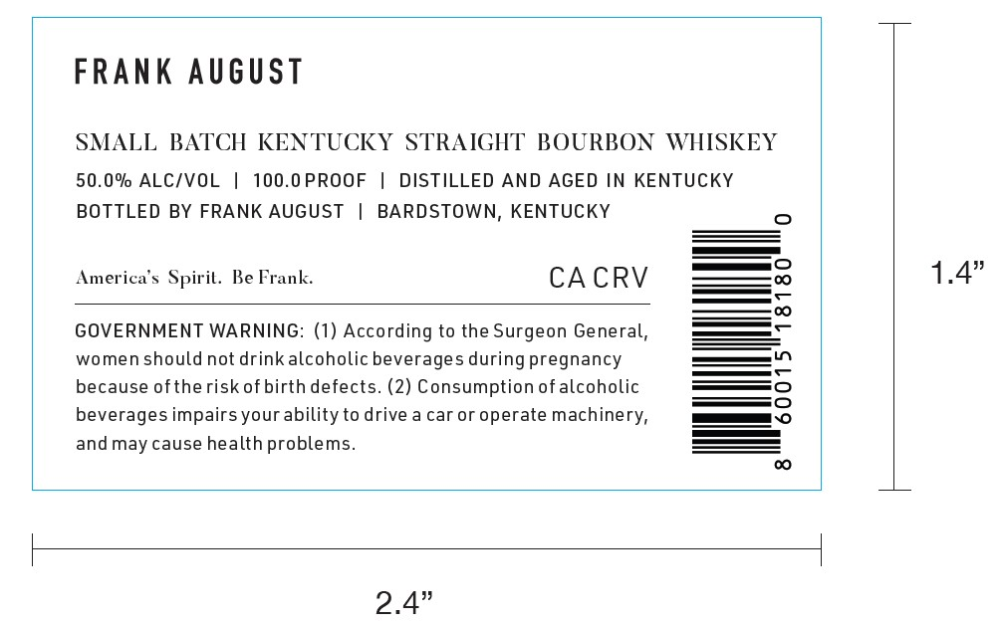
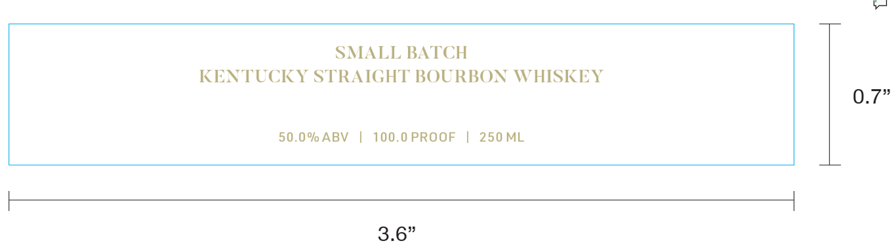

# TTB COLA Label Images - TTBID 26120001000741

**Brand Name:** FRANK AUGUST

**Issue Date:** 05/06/2026

**Origin Code:** 22

**Product Class/Type:** 101

**Source:** [TTB Public COLA Registry](https://ttbonline.gov/colasonline/viewColaDetails.do?action=publicFormDisplay&ttbid=26120001000741)

## Label Images

### Label 1

### Label 2

## Extracted Label Text

*Text extracted via OCR - may contain errors*

**Detected Proof:** 100

### Label 1

FRANK August
SMALL
BATCH
KENTUCKY STRAIGHT BOURBON
WHISKEY
50.0% ALCIVOL
100.0PROOF
DISTILLED AND AGED IN KENTUCKY
BOTTLED BY FRANK AUGUST
BARDSTOWN,
KENTUCKY
America $ Spiril. Be Frank:
CA CRV
1.4"
GOVERNMENT WARNING: (1) According to the Surgeon General,
women should not drink alcoholic beverages during pregnancy
because ofthe risk ofbirth defects. (2) Consumption of alcoholic
beverages impairs your ability to drive a car or operate machinery;
andmay cause health problems_
2.4"

### Label 2

SMALL BATCH
KENTUCKY STRAIGHT BOURBON WHISKEY
0_
50.0% ABV
100.0 PROOF
250 ML
3.6"
.7"
