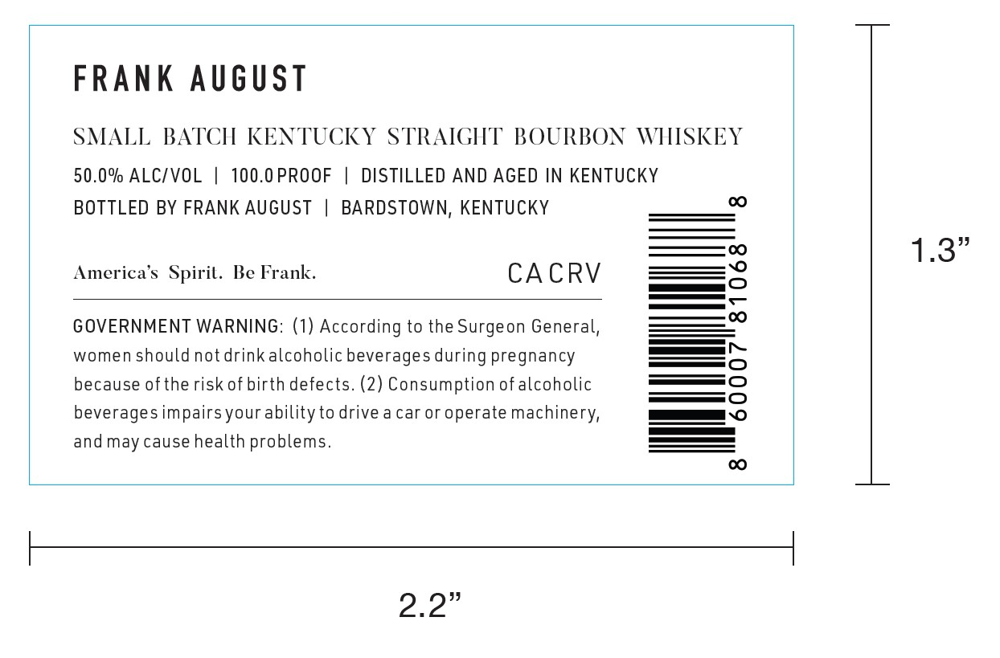
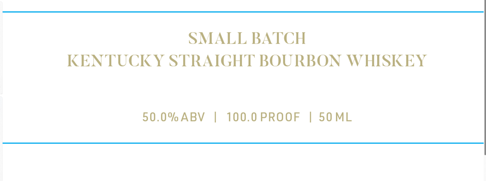

# TTB COLA Label Images - TTBID 26120001000746

**Brand Name:** FRANK AUGUST

**Issue Date:** 05/05/2026

**Origin Code:** 22

**Product Class/Type:** 101

**Source:** [TTB Public COLA Registry](https://ttbonline.gov/colasonline/viewColaDetails.do?action=publicFormDisplay&ttbid=26120001000746)

## Label Images

### Label 1

### Label 2

## Extracted Label Text

*Text extracted via OCR - may contain errors*

**Detected Proof:** 100

### Label 1

FRANK August
SMALL BATCH KENTUCKY STRAIGHT BOURBON WHISKEY
50.0% ALCIVOL
100.0 PROOF
DISTILLED AND AGED IN KENTUCKY
BOTTLED BY FRANK AUGUST
BARDSTOWN, KENTUCKY
0
1.3"
America 's Spiril. Be Frank
CACRV
GOVERNMENT WARNING: (1) According to the Surgeon General,
3
women should not drink alcoholic beverages during pregnancy
because of the risk of birth defects. (2) Consumption ofalcoholic
8
beverages impairsyour ability to drive a car or operate machinery,
and may cause health problems_
CO
2.2"

### Label 2

SMALL BATCH
KENTUCKY STRAIGHT BOURBON WHISKEY
50.0% ABV
100.0 PROOF
1
50 ML
