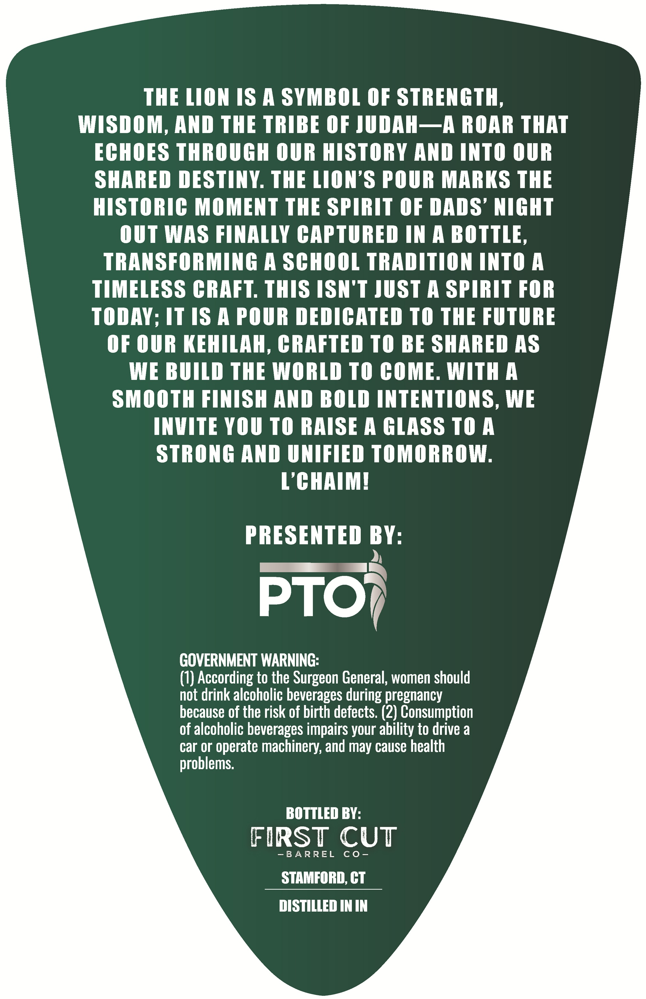
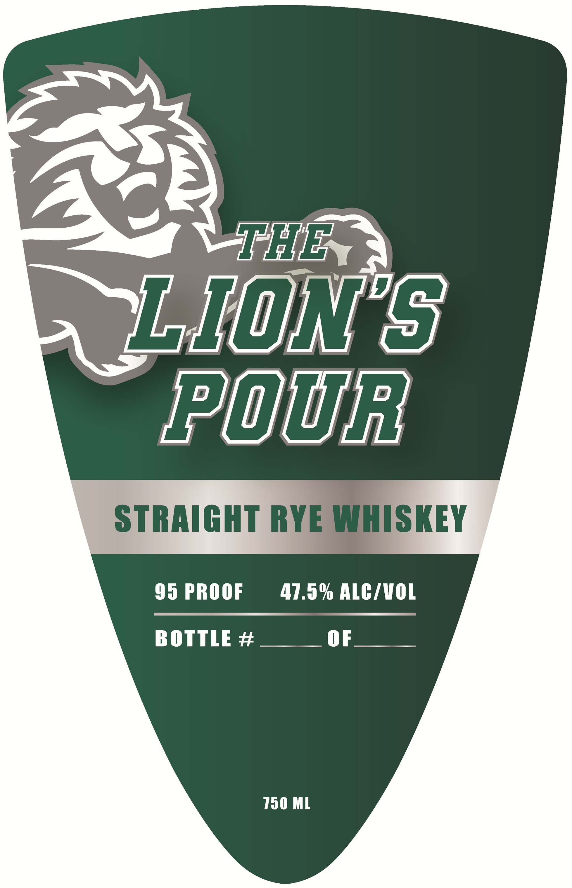

# TTB COLA Label Images - TTBID 26120001000869

**Brand Name:** LION'S POUR

**Issue Date:** 05/05/2026

**Origin Code:** 14

**Product Class/Type:** 102

**Source:** [TTB Public COLA Registry](https://ttbonline.gov/colasonline/viewColaDetails.do?action=publicFormDisplay&ttbid=26120001000869)

## Label Images

### Back Label

### Front Label

## Extracted Label Text

*Text extracted via OCR - may contain errors*

**Detected Proof:** 93

### Back Label

THE LION 1S A SYMBOL OF STRENGTH,

WISDOM, AND THE TRIBE OF JUDAH—A ROAR THAT

ECHOES THROUGH OUR HISTORY AND INTO OUR

SHARED DESTINY. THE LION’S POUR MARKS THE

HISTORIC MOMENT THE SPIRIT OF DADS’ NIGHT

OUT WAS FINALLY CAPTURED IN A BOTTLE,

TRANSFORMING A SCHOOL TRADITION INTOA

TIMELESS CRAFT. THIS ISN'T JUST A SPIRIT FOR

TODAY; IT 1S A POUR DEDICATED T0 THE FUTURE

OF OUR KEHILAH, CRAFTED TO BE SHARED AS

WE BUILD THE WORLD TO COME. WITHA

SMOOTH FINISH AND BOLD INTENTIONS, WE

INVITE YOU TO RAISE A GLASS TOA

STRONG AND UNIFIED TOMORROW.

L’CHAIM!

PRESENTED BY:

PTO}

GOVERNMENT WARNING:

(1) According to the Surgeon General, women should

not drink alcoholic beverages during pregnancy

of alcoholic beverages impairs your ability to drive a

because of the risk of birth defects. (2) Consumption

car or operate machinery, and may cause health

problems.

BOTTLED BY:

FIRST CUT

-BARREL CO-

STAMFORD, CT

DISTILLED IN IN

### Front Label

AS:

= ate
WEIONES
LAD ini

STRAIGHT RYE WHISKEY

93 PROOF 47.5% ALC/WOL
BOTTLE# OF
