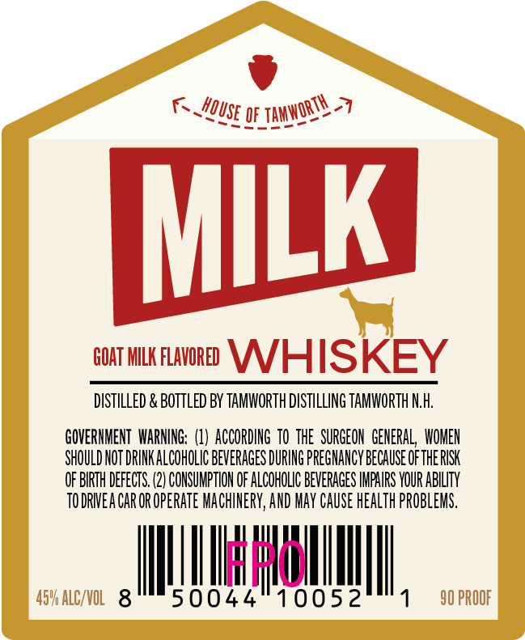
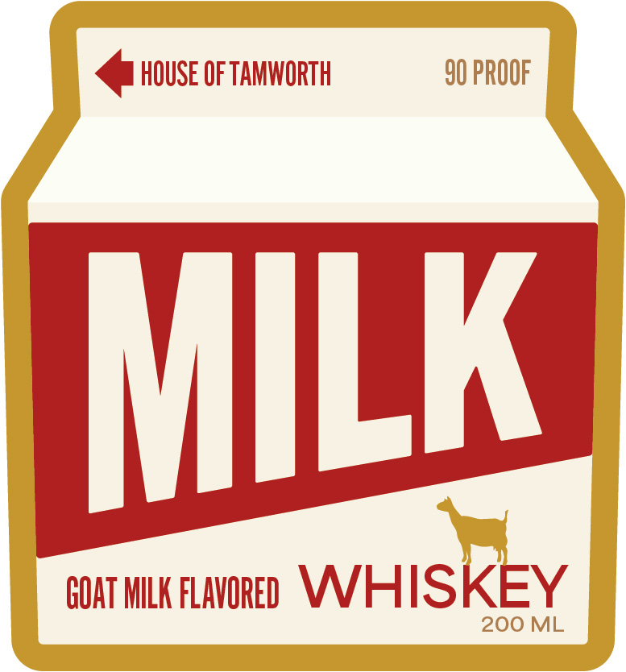

# TTB COLA Label Images - TTBID 26120001000904

**Brand Name:** MILK

**Issue Date:** 05/07/2026

**Origin Code:** 33

**Product Class/Type:** 149

**Source:** [TTB Public COLA Registry](https://ttbonline.gov/colasonline/viewColaDetails.do?action=publicFormDisplay&ttbid=26120001000904)

## Label Images

### Back Label

### Front Label

## Extracted Label Text

*Text extracted via OCR - may contain errors*

**Detected Proof:** 90

### Back Label

K_
7
QF
MILk
GOAT MILK FLAVORED
WHISKEY
DSTILLED & BOTTLED BY TAMWORTH DISTHLLING TAMWORTH NLH:
GOVERHMENT  WARNING: (1}  ACCORDING  TO  THE  SURGEON   GENERAL   WOMEN
SHOULD NOT DRINK ALCOHOLIC BEVERAGES DURING PREGHANCY because OFthe RISK
OF BIRTH DefEcTS: (2) CONSUMPTHOH OF ALCOHOLIC BEVERAGES IHPHIRS VOUR ABILITY
TODRVEA CAR OR OpeRATe MaChiNERY, AND May Cause health PROBLEMS,
hdl
459 ALCVOL   8
50044
10052
90 PROOF
~Tamworth _
HQUSE =

### Front Label

<@ House oF TAMWoRTH 90 PROOF
GOAT MILK FLAVORED WWHIS KEY
