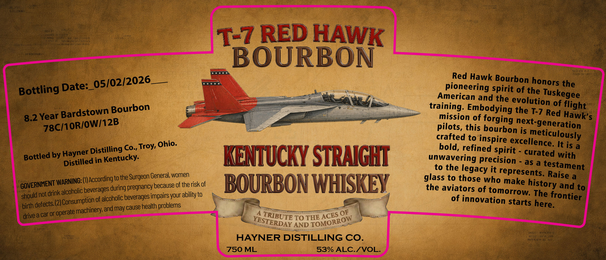

# TTB COLA Label Images - TTBID 26121001000070

**Brand Name:** HAYNER DISTILLING CO.

**Fanciful Name:** T-7 RED HAWK BOURBON

**Issue Date:** 05/06/2026

**Origin Code:** 09

**Product Class/Type:** 101

**Source:** [TTB Public COLA Registry](https://ttbonline.gov/colasonline/viewColaDetails.do?action=publicFormDisplay&ttbid=26121001000070)

## Label Images

### Label 1

## Extracted Label Text

*Text extracted via OCR - may contain errors*

**Detected Proof:** 106
**Detected Age:** 8.2 Years

### Label 1

T-7 RED HAWK
BOURBON
05/02/2026
iRed Hawk Bourbon honors the
Bottling Date:_
necicaeria9d Pieit %the Oskebee
American and the evolution
Bardstown Bourbon
training; Embodyingethe 1joRed Haght
8.2 Year
mission %f forging
Hawk'$
78C/1OR/OW/12B
pilots, this bourbon
exheeneration
crafted to inspire excellenceu
Distilling Cox Troy, Ohio.
bold, refined spirit
It is a
by Hayner
in
Kentucky:
KENTUCKY STRNICHI
unwavering precision
curated with
to the
as a
testament
(IJAccording to the Surgeon General, women
glass toe thegsecwho
represents. Raise &
"WARnicteerardisduring pregnancy becausgaf theriskof
BOURBON WHISKEY
the aviators of
make
and to
not drink =
of alcoholic beverages impairs your ability to
"oatooationostorts The
birth
(2) Consumption _
cause health
starts
machinery; and may
OF
drive a car Or 5
TO THE
AND
Ffiit
HAYNER DISTILLING CO_
750 ML
53% ALC.IVOL:
meticulously
Bottled
Distilled
legacy
history
GOVERNMENT
alcoholic
frontier
should
here.
defects (
problems
operate
TRIBUTE
ACES
TOMORROW
YESTERDAY
