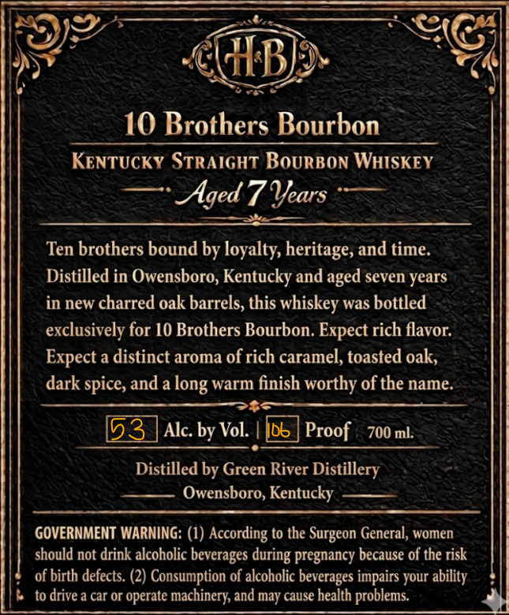
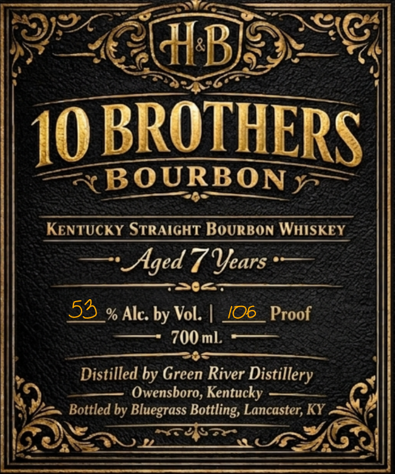

# TTB COLA Label Images - TTBID 26121001000151

**Brand Name:** 10 BROTHERS

**Issue Date:** 06/10/2026

**Origin Code:** 22

**Product Class/Type:** 101

**Source:** [TTB Public COLA Registry](https://ttbonline.gov/colasonline/viewColaDetails.do?action=publicFormDisplay&ttbid=26121001000151)

## Label Images

### Back Label

### Front Label

## Extracted Label Text

*Text extracted via OCR - may contain errors*

**Detected Proof:** 106
**Detected Age:** 7 Years

### Back Label

B
10 Brothers Bourbon
KENTUCKY STRAIGHT BoURBON WHISKEY
Aged 7 Years
Ten brothers bound by loyalty heritage, and time
Distilled in Owensboro Kentucky and
seven years
in new charred oak barrels, this whiskey was bottled
exclusively for 10 Brothers Bourbon: Expect rich flavor:
Expect a distinct aroma of rich caramel, toasted oak,
dark .
and a
warm finish worthy of the name:
13
Alc. by Vol.
Iob
Proof
700 ml.
Distilled by Green River Distillery
Owensboro, Kentucky
GOVERNMENT WARNING: (1) According to the Surgeon General; women
should not drink alcoholic beverages during pregnancy because of the risk
of birth defects. (2) Consumption of alcoholic beverages impairs your ability
to drive a car or operate
machinery; and may cause health problems:
aged
spice;
long

### Front Label

(B
BROTHERS
BOURBON y
KENTUCKY STRAIGHT BoURBON WHISKEY
Aged 7 Years
53 % Alc: by Vol.
106
Proof
700 mL
Distilled by Green
Distillery
Owensboro, Kentucky
Bottled by Bluegrass Bottling, Lancaster, KY
10
River
