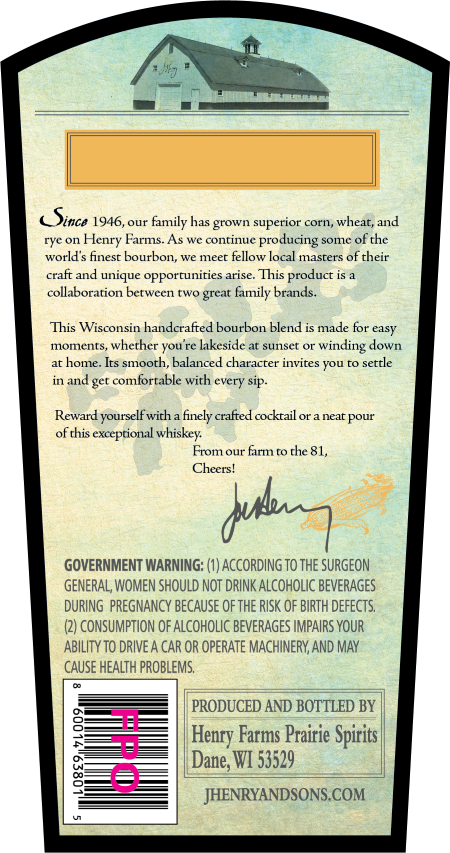
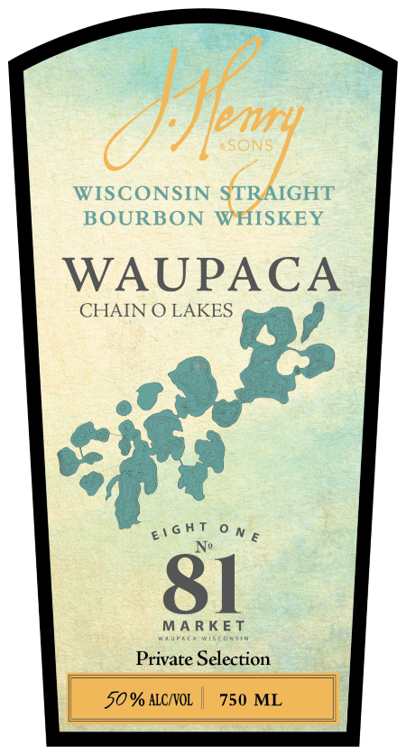

# TTB COLA Label Images - TTBID 26121001000156

**Brand Name:** J. HENRY & SONS

**Fanciful Name:** CHAIN O' LAKES

**Issue Date:** 05/06/2026

**Origin Code:** 48

**Product Class/Type:** 101

**Source:** [TTB Public COLA Registry](https://ttbonline.gov/colasonline/viewColaDetails.do?action=publicFormDisplay&ttbid=26121001000156)

## Label Images

### Back Label

### Front Label

### Label 3

## Extracted Label Text

*Text extracted via OCR - may contain errors*

*1 image(s) excluded: text did not meet readability threshold*

### Back Label

Since 1946,
family has
superior corn
wheat; and
rye on Henry Farms- As we continue
producing
somc
ofthe
world s finesc boutbon
mnee0
fellow local masters of their
craft and unique opporrunities arise: This product is
collaboration between
lt
lamily brands.
This Wisconsin handcrafted bourbon blend is made for easy
moments, whether you re lakeside at sunset o
down
at hone. Its smooth; balanced character invites YOu r0 settle
and get comfortable with every sip
Reward yourself with a finely crafted cockrail or a near
of this exceprional whiskey
From our frmto che 81,
Cheers!
GOVERNMENT WARNING: (1) ACCORDING To thE SURGEON
GENERAL; WOMEN SHOULD NOT DRINK ALCoHOLIC BEVERAGES
DURING   PREGNANCY BECAuSE oF thE RISK OF BIRTH DeFECTS,
(2} CONSUMPTION oF ALcoholic BEVERAGES IMPAIRS YouR
ABILITY TO DRIVE A CAR OR OPERATE MACHINERV; AND MAY
CaUSE HEALTH PROBLEMS;
PRODUCED AND BOTTLED BY
Farms Prairie Spirits |
Dane; WI 53529
JHENRYANDSONS.COM
grown
grea
winding
pour
dui
Henry

### Front Label

aSONS

WISCONSIN oft

IGHT

BOURBON

ISKEY

WAUPACA

CHAIN O LAKES

f

of.

eich One

Sl

eae

Private Selection
