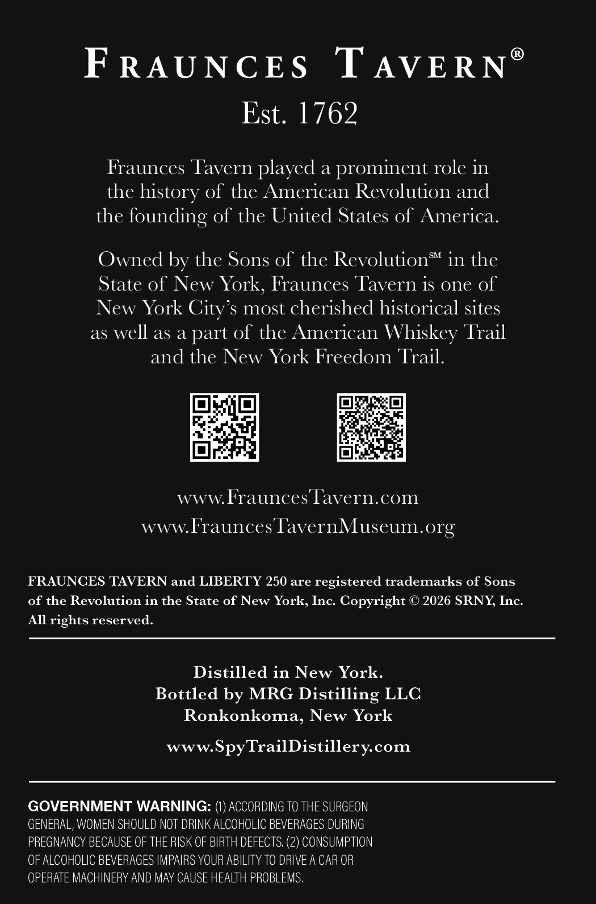
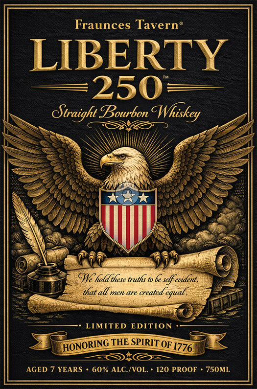

# TTB COLA Label Images - TTBID 26121001000174

**Brand Name:** FRAUNCES TAVERN LIBERTY 250

**Issue Date:** 05/07/2026

**Origin Code:** 02

**Product Class/Type:** 101

**Source:** [TTB Public COLA Registry](https://ttbonline.gov/colasonline/viewColaDetails.do?action=publicFormDisplay&ttbid=26121001000174)

## Label Images

### Back Label

### Front Label

## Extracted Label Text

*Text extracted via OCR - may contain errors*

**Detected Proof:** 120
**Detected Age:** 7 Years

### Back Label

FRAUNCES
T AVE RN
Est. 1762
Fraunces Tavern played a prominent role in
the history of the American Revolution and
the
founding of the United States of America.
SM
Owned by the Sons of the Revolution
in the
State of New York; Fraunces 'Tavern iS one of
New York City $ most cherished historical sites
as well as a part of the American
Whiskey Trail
and the New York Freedom Trail.
WWW
Fraunces Tavern.com
wWWFrauncesTavernMuseum.org
FRAUNCES TAVERN and LIBERTY 250 are registered trademarks of Sons
of the Revolution in the State of New York, Inc Copyright
2026 SRNY Inc:
All rights reserved:
Distilled in New York.
Bottled by MRG Distilling LLC
Ronkonkoma, New York
www.SpyTrailDistillerycom
GOVERNMENT WARNING:
ACCORDING TO THE SURGEON
GENERAL, WOMEN SHOULD Not DRINK ALCOHOLIC BEVERAGES DURING
PREGNANCY BECAUSE OF THE RISK OF BIRTH DEFECTS. (2) CONSUMPTION
OF ALCOHOLIC BEVERAGES IMPAIRS YOUR ABILITY TO DRIVE A CAR OR
OPERATE MACHINERY AND May CAUSE HEALTH PROBLEMS,

### Front Label

Fraunces Taverne
LIBERTY
250
Otraight Bourbon Whiskey
WG holdthese truths to be selfevident,
that all men are created €
LIMITED EDITION
THE SPIRIT OF 1776
AGED 7 YEARS
60% ALC /VOL
120 PROOF
750ML
egual,
HONORING
