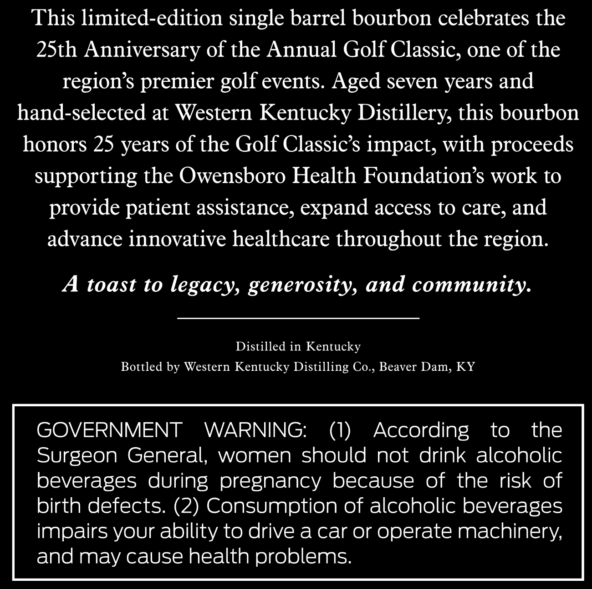
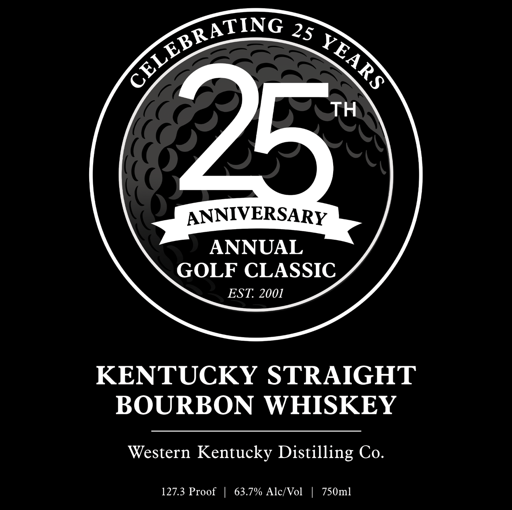

# TTB COLA Label Images - TTBID 26121001000343

**Brand Name:** 25TH ANNIVERSARY GOLF CLASSIC

**Issue Date:** 05/05/2026

**Origin Code:** 22

**Product Class/Type:** 101

**Source:** [TTB Public COLA Registry](https://ttbonline.gov/colasonline/viewColaDetails.do?action=publicFormDisplay&ttbid=26121001000343)

## Label Images

### Back Label

### Front Label

## Extracted Label Text

*Text extracted via OCR - may contain errors*

**Detected Proof:** 127.3
**Detected Age:** 25 Years

### Back Label

This limited-edition single barrel bourbon celebrates the
25th Anniversary of the Annual Golf Classic, one of the
regions premier
events. Aged seven years and
hand-selected at Western
Kentucky Distillery, this bourbon
honors 25 years of the Golf Classic s impact, with proceeds
supporting the Owensboro Health Foundations work to
provide patient assistance, expand access to care, and
advance innovative healthcare throughout the
A toast to
legacy generosity, and community.
Distilled in Kentucky
Bottled by Western Kentucky Distilling
Beaver Dam; KY
GOVERNMENT
WARNING:
(1)
According
to
the
Surgeon General;
women should not drink alcoholic
beverages during pregnancy because
of the risk of
birth defects: (2) Consumption of alcoholic beverages
impairs your ability to drive a car or operate machinery;
and may cause health problems:
golf
region:
Co ,

### Front Label

25
25
ANNIVERSARY
ANNUAL
GOLF CLASSIC
EST: 2001
KENTUCKY STRAIGHT
BOURBON
WHISKEY
Western Kentucky Distilling Co.
127.3 Proof
63.7% Alc/Vol
750ml
CELEBRATING
YEARS
