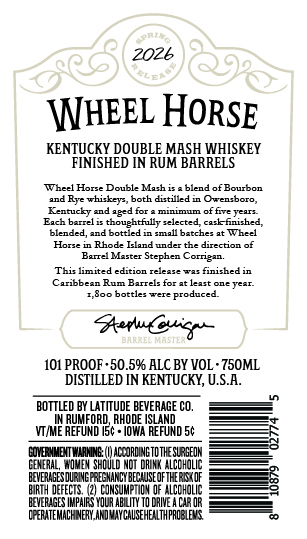
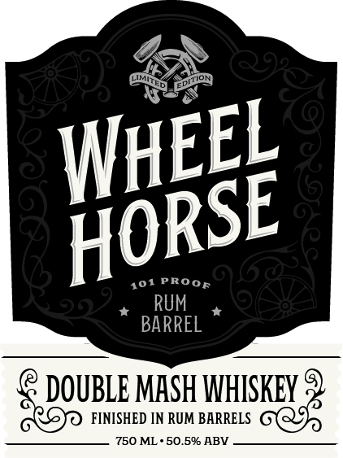

# TTB COLA Label Images - TTBID 26121001000375

**Brand Name:** WHEEL HORSE

**Issue Date:** 05/06/2026

**Origin Code:** 40

**Product Class/Type:** 140

**Source:** [TTB Public COLA Registry](https://ttbonline.gov/colasonline/viewColaDetails.do?action=publicFormDisplay&ttbid=26121001000375)

## Label Images

### Back Label

### Front Label

## Extracted Label Text

*Text extracted via OCR - may contain errors*

**Detected Proof:** 101

### Back Label

2026

\NHEEL HORSE

KENTUCKY DOUBLE MASH WHISKEY
FINISHED IN RUM BARRELS

‘Wheel Horse Double Mach is «blend of Bourbon
tnd Rye whiskey, both dated in Owensbora,
‘Kentucky and aged for a minimum of ve year
Each berslis thoughtfully selected, cask fae,
‘lended, and bottied in mal batches at Wheel
Hlorte in Rhode Island under the direction of
Barrel Master Stephen Corrigen
‘This limited edition relesse was finished in
(Caribbean Rum Barrels for at least one yeer
TiSoe bottles were produced

Patan

101 PROOF -50.59% ALC BY VOL-750ML

DISTILLED IN KENTUCKY, U.S.A.
\T/ME REFUND I5¢ + IOWA REFUND St ===

ERENT ARNG) CORONGTOTESTRSEDN
GENERAL, WOMEN SHOULD NOT ORE. ALCOHOL
BEVERAGES URN RESIN BECAUSE OFTHE RCO =
ORTH FETS. (2) CONSUMPTION OF ALCOHOL
DEVEIGES MPARS YOUR ABLITY TOORNEACAR OR, —
CPEITENACENERY ANDERE TPOLENS 70

### Front Label

PROOF
RUM
BARREL
DOUBLE MHSH WHISKEY
FINISHED IN RUM BARRELS
750 ML . 50.59 ABV
WhEEL
HORSE
101
