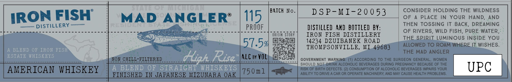

# TTB COLA Label Images - TTBID 26121001000379

**Brand Name:** MAD ANGLER

**Issue Date:** 05/05/2026

**Origin Code:** 06

**Product Class/Type:** 129

**Source:** [TTB Public COLA Registry](https://ttbonline.gov/colasonline/viewColaDetails.do?action=publicFormDisplay&ttbid=26121001000379)

## Label Images

### Label 1

## Extracted Label Text

*Text extracted via OCR - may contain errors*

**Detected Proof:** 103

### Label 1

DSP-MI-20053

CONSIDER HOLDING THE WILDNESS

OF A PLACE IN YOUR HAND, AND

IRON FISH

MAD SREERR.

15 BATCH No

THEN TOSSING IT-BACK, DREAMING

=== DISTILLERY ——

Se ee SSeS oe eee ee

PROOF

DISTILLED AND BOTTLED BY

Stes eo ee eS ey MOOS

ORIGIN STORY

IRON FISH DISTILLERY

OF RIVERS, WILD FISH, PURE: WATER

14234 DZUIBANEK ROAD

THE SPIRIT LUMINOUS INSIDE YOU

51.5%

ALLOWED TO ROAMIWHERE IT, WISHES

THOMPSONVILLE, M1_.49683

THE MAD ANGLER

ALC ay VOL

-

BS eee eee ee

pee eigen twee ato eeo eee OS ee Se et ee Se a

NON CHILL: FUMTERED

GOVERNMENT WARNING: (1) ACCORDING TO THE SURGEON GENERAL, WOMEN

SHOULD NOT-DRINK ALCOHOLIC BEVERAGES DURING PREGNANCY BECAUSE OF THE

af

RISK OF BIRTH DEFECTS. (2) CONSUMPTION OF ALCOHOLIC BEVERAGES IMPAIRS YOUR

AMERICAN WHISKEY

7501 | <<

ABILITY TO DRIVE A CAR OR OPERATE MACHINERY, AND MAY CAUSE HEALTH PROBLEMS.

UPC

FINISHED IN JAPANESE MIZUNARA OAK
