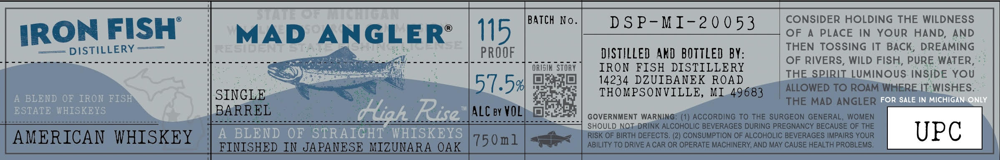

# TTB COLA Label Images - TTBID 26121001000386

**Brand Name:** MAD ANGLER

**Issue Date:** 05/06/2026

**Origin Code:** 06

**Product Class/Type:** 129

**Source:** [TTB Public COLA Registry](https://ttbonline.gov/colasonline/viewColaDetails.do?action=publicFormDisplay&ttbid=26121001000386)

## Label Images

### Label 1

## Extracted Label Text

*Text extracted via OCR - may contain errors*

### Label 1

1n
n
BATCH No.
D S P- M I-2 0 0 53
CONSIDER HOLDING THE WILDNESS
IRON FISH
MAD ANGLER
115
OF
A
PLACE IN YOUR HAND; AND
DISTILLERY
HEle

PROOF
DISTILLED  AND BOTTLED BY:
THEN TOSSING IT BACK; DREAMING
OF RIVERS, WILD FISH, PURE WATER,
ORISIR STORY
IRON FISH DISTILLERY
THE SPIRIT LUMINOUS INSIDE YOU
57.54
14234 DZUIBANEK ROAD
ALLOWED TO ROAM WHERE IT WISHES:
A BLEND OF IRON FISH
SINGLE
THOMPSONVILLE, MI 49683
THE MAD ANGLER FOR SALE IN MICHIGAN ONLY
ESTATE  WHISKEYS
BARREL
HehRisa
ALC by VOLT
GOVERNMENT WARNING: (1) ACCORDING To THE SURGEON GENERAL; WOMEN
SHOULD NOT DRINK ALCOHOLIC BEVERAGES DURING PREGNANCY BECAUSE OF
AMERICAN WHISKEY
A
BLEND OF STRAIGHT WHISKEYS
750m1
RISK OF BIRTH DEFECTS
2) CONSUMPTION OF ALCOHOLIC BEVERAGES IMPAIRS YOUR
UPC
FINISHED IN JAPANESE MIZUNARA OAK
ABILITY TO DRIVE A CAR OR OPERATE MACHINERY, AND MAY CAUSE HEALTH PROBLEMS:
THE
