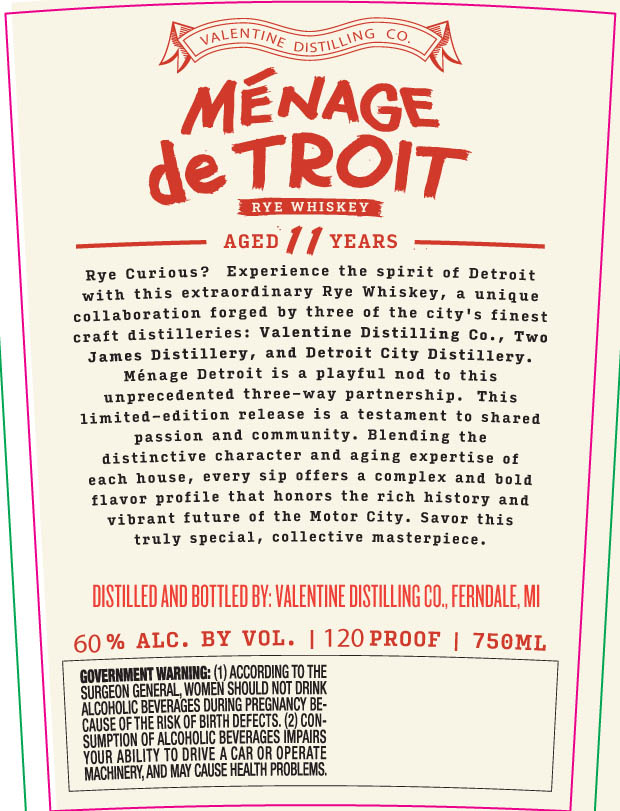
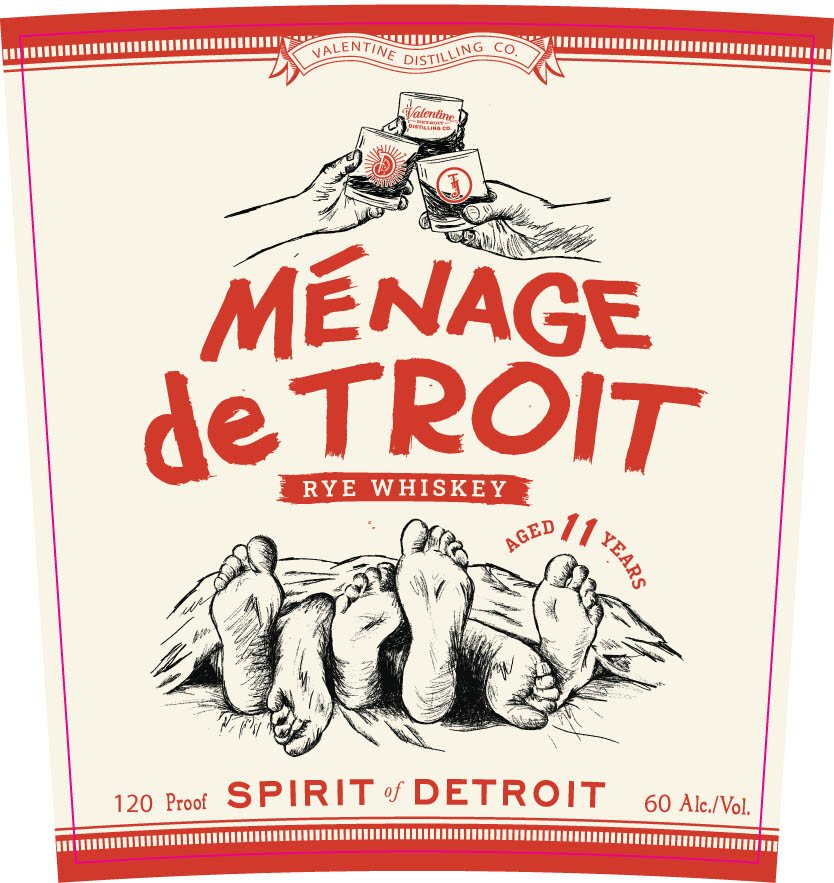

# TTB COLA Label Images - TTBID 26121001000442

**Brand Name:** MENAGE DETOIS

**Issue Date:** 05/06/2026

**Origin Code:** 06

**Product Class/Type:** 142

**Source:** [TTB Public COLA Registry](https://ttbonline.gov/colasonline/viewColaDetails.do?action=publicFormDisplay&ttbid=26121001000442)

## Label Images

### Back Label

### Front Label

## Extracted Label Text

*Text extracted via OCR - may contain errors*

**Detected Proof:** 120
**Detected Age:** 11 Years

### Back Label

VALENTINE
MENAGE
de TPOIT
RYE WHISKEY
AGED
11YEARS
Rye Curious ?
Experience
the spirit 0f Detroit
with
this
extraordinary
Rye Whiskey ,
unique
collaboration forged
by
three of the
finest
craft distilleries:
Valentine
Distilling
Two
James Distillery,
and
Detroit City Distillery.
Menage Detroit is
playful
nod
this
unprecedented three-way partnership.
This
limited-edition
release is
testament to shared
passion
and
community. Blending the
distinctive character and aging
expertise of
each
house ,
every sip offers
complex and bold
flavor
profile that honors the rich history and
vibrant future of
the
Motor City.
Savor this
truly special,
collective
masterpiece.
DISTILLED AND BOTTLED BV; VALENTINE DISTILLING CO, FERNDALE M
60 %
ALC. BY VOL .
120 PROOF
750ML
SORGEONGETERALMIA
HAEscoop
JNG Bthe
SURCEON
ALCoHoLic BeVERAgEs duaiepreGMAnCY BE:
CAUSE QeThe RISK @F BIRTHDEEECTS:
CON
0F ALCOHOLIC BEVERAGES UPARS
SEEb
ABiLity TO DRWVE
CAR OR OPERATE
MACHNEAY AND MAy CAUSE HEALTH PROBLEMS
DistillinG
city'$
Co. ,

### Front Label

EN
DISTI
Watentine
MENAGE
de TROIT
RYE WHISKEY
1
120 Proof
SPIRIT
DETROIT
60 Alc /Vol,
LING
TINE
AGED
1
