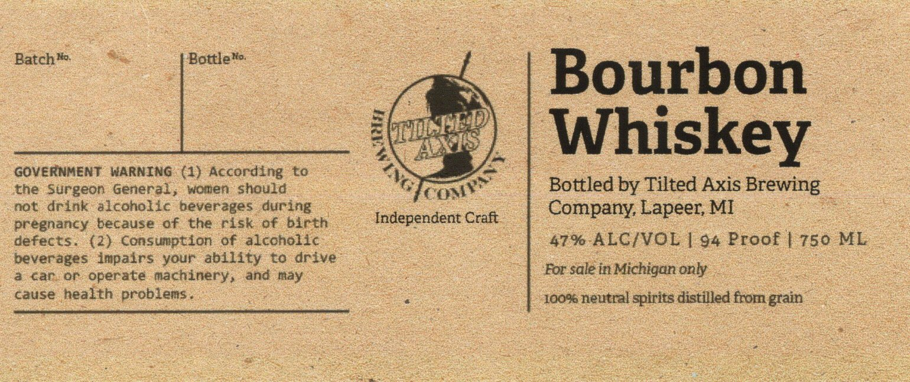

# TTB COLA Label Images - TTBID 26121001000522

**Brand Name:** TILTED AXIS BREWING COMPANY

**Fanciful Name:** BOURBON WHISKEY

**Issue Date:** 05/05/2026

**Origin Code:** 06

**Product Class/Type:** 141

**Source:** [TTB Public COLA Registry](https://ttbonline.gov/colasonline/viewColaDetails.do?action=publicFormDisplay&ttbid=26121001000522)

## Label Images

### Label 1

## Extracted Label Text

*Text extracted via OCR - may contain errors*

**Detected Proof:** 94

### Label 1

Batch %a
BottleHo
Bourbon
Whiskey
GOVERNMENT
WARNING (1) According
L0
the surgeon
General,
Mcaden
should
C0:
Bottled by Tilted Axis Brewing
not
drink
alcoholic beverages during
Company; Lapeer; MI
pregnancy
because
of
the
risk
of
birth
Independent Craft
defects
(2} Consumption
of
alcoholic
47% ALC/VOL
94 Proof | 750 ML
beverages Impalrs
your abillty
to
drive
car
or operate machinery,
and nay
For sale in Michigan only
cause
health problens
10096 neutral spirits distilled from grain
