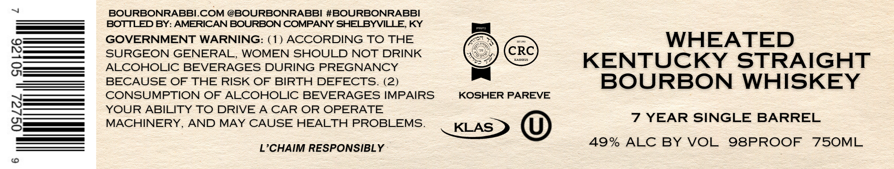

# TTB COLA Label Images - TTBID 26121001000687

**Brand Name:** BOURBONRABBI

**Issue Date:** 05/12/2026

**Origin Code:** 22

**Product Class/Type:** 101

**Source:** [TTB Public COLA Registry](https://ttbonline.gov/colasonline/viewColaDetails.do?action=publicFormDisplay&ttbid=26121001000687)

## Label Images

### Label 1

### Label 2

## Extracted Label Text

*Text extracted via OCR - may contain errors*

*1 image(s) excluded: text did not meet readability threshold*

**Detected Proof:** 98
**Detected Age:** 7 Years

### Label 2

BOURBONRABBICOM @BOURBONRABBI #BOURBONRABBI
BOTTLED BY: AMERICAN BOURBON COMPANY SHELBYVILLE, KY
GOVERNMENT WARNING: ( 1) ACCORDING TO THE
WHEATED
8
SURGEON GENERAL,
WOMEN SHOULD NOT DRINK
CRC
Kastala
KENTUCKY
STRAIGHT
ALCOHOLIC BEVERAGES DURING PREGNANCY
BECAUSE OF THE RISK OF
BIRTH DEFECTS. (2)
BOURBON
WHISKEY
CONSUMPTION OF ALCOHOLIC BEVERAGES IMPAIRS
KOSHER PAREVE
8
YOUR ABILITY TO DRIVE
A CAR OR OPERATE
MACHINERY,
AND MAY CAUSE HEALTH PROBLEMS.
7 YEAR SINGLE BARREL
KLAS
L'CHAIM RESPONSIBLY
49%
ALC BY VOL
98PROOF
75OML
