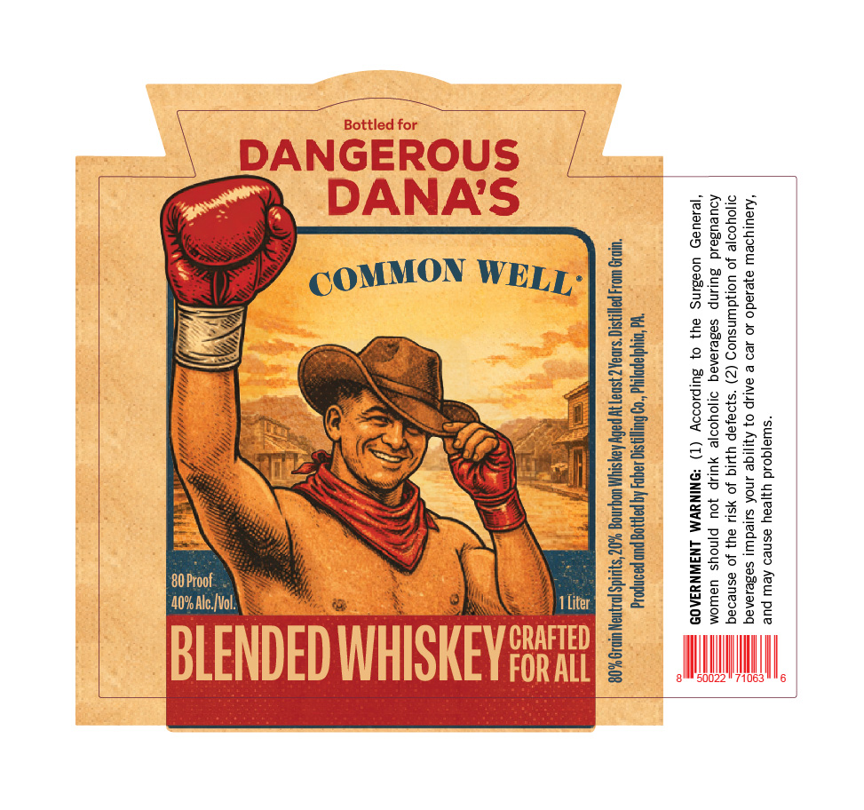

# TTB COLA Label Images - TTBID 26121001000715

**Brand Name:** COMMON WELL

**Fanciful Name:** SOUTH PAW

**Issue Date:** 06/03/2026

**Origin Code:** 39

**Product Class/Type:** 137

**Source:** [TTB Public COLA Registry](https://ttbonline.gov/colasonline/viewColaDetails.do?action=publicFormDisplay&ttbid=26121001000715)

## Label Images

### Label 1

## Extracted Label Text

*Text extracted via OCR - may contain errors*

### Label 1

Bottled for
DANGEROUS
Cap DANA'S Pee
\, Oeeeeee | SSE
Agassi) gk
heey COMMONWELE]E bre
rs fe tae
a Be
= =< Mie os
© SR CSS meee 2552
2 TAS Ue Est | Ea
Ay, SIX _« Wie 5 eas:
a Si SS} \ ea =2283
"i = Se ene
0Proof VS 7 * | Be 22382
cnet li Ce “SE i ee EU:
FCAT) VANLIFCI/ VY CRAFTED eae
BLENDED WHISKEY sik Em
EG: Ei eee rote eee Betis essen
ee eo Se
