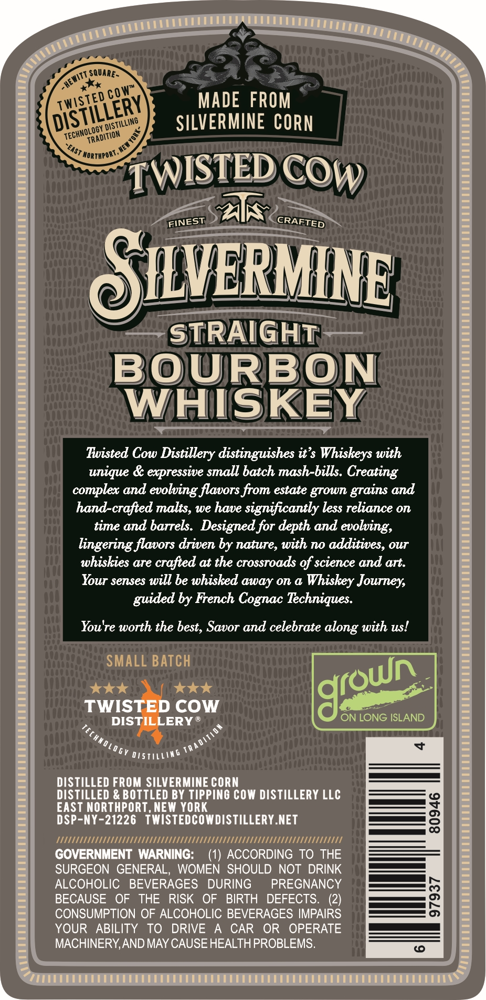
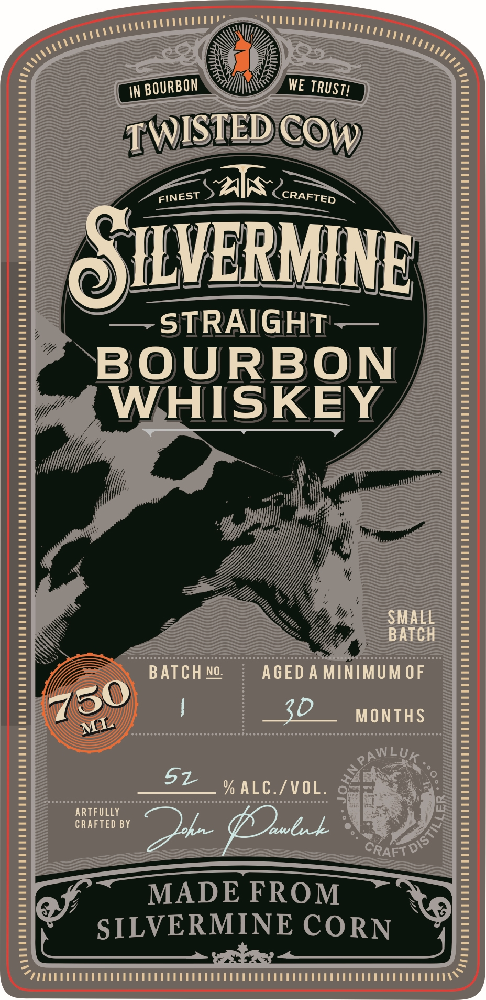

# TTB COLA Label Images - TTBID 26121001000739

**Brand Name:** SILVERMINE STRAIGHT BOURBON WHISKEY

**Issue Date:** 05/07/2026

**Origin Code:** 02

**Product Class/Type:** 101

**Source:** [TTB Public COLA Registry](https://ttbonline.gov/colasonline/viewColaDetails.do?action=publicFormDisplay&ttbid=26121001000739)

## Label Images

### Back Label

### Front Label

## Extracted Label Text

*Text extracted via OCR - may contain errors*

### Back Label

SQuAre -
MADE  FROM
SILVERMINE CORN
NorthPort
AK
OIVERMINE
STRAIGHT
BOURBON
WHISKEY
Twisted Cow Distillery distinguishes it'$ Whiskeys with
unique & expressive small batch mash-bills. Creating
complex and evolving flavors from estate grown
and
hand-crafted malts, we have significantly less reliance on
time and barrels:  Designed for depth and evolving;
lingering flavors driven by nature, with no additives, our
whiskies are crafted at the crossroads of science and art.
Your senses will be whisked away on a
Whiskey Journey,
guided by French Cognac Techniques:
You're worth the
Savor and celebrate
with us!
SMALL BATCHE
TWISTED COW
DISTILLERY R
ON LONG ISLAND
#x
T 0
QT5IL
DISTILLED FROM SILVERMINE CORN
DISTILLED & BOTTLED BY TIPPINO COW DISTILLERY LLC
EAST NORTHPORT, NEW YORK
3
DSP-NY-21226   TWISTEDCOWDISTILLERY.NET
IIIlll
Ml
GOVERNMENT WARNING:
(1) ACCORDING TO THE
SURGEON GENERAL, WOMEN SHOULD NOT DRINK
ALCOHOLIC
BEVERAGES
DURING
PREGNANCY
BECAUSE
OF
THE
RISK
OF
BIRTH
DEFECTS.
(2)
2
CONSUMPTION OF ALCOHOLIC BEVERAGES IMPAIRS
YOUR
ABILITY
To
DRIVE
CAR
OR
OPERATE
MACHINERY,AND MAY CAUSE HEALTHPROBLEMS.
~HEWITT =
cow"
Twisted
DISTILLERY
'DISTILLING
~TECHMOLOGY -
1
TRADITION
~EAST
'TWISTED
COW
CRAFTED
FINEST
grains
best,
along
Idroun
DITIOM

### Front Label

IN
WE
TWISTEDc
S1K <
OILVERMINE
STRAIGHT
BOURBON
WHISKEY
SMALL
BATCH
BATCH No:
AGED A MINIMUM OF
MONTHS
PAWLUK_
5z
% ALC./VOL.
ARTFULLY
CRAFTED BY
~ykz
awbxk
MADE FROM
SILVERMINE CORN
BOURBON
TRUST!
COw
CRAFTED
FINEST
750
3D
ML
DIST
CRAFT
