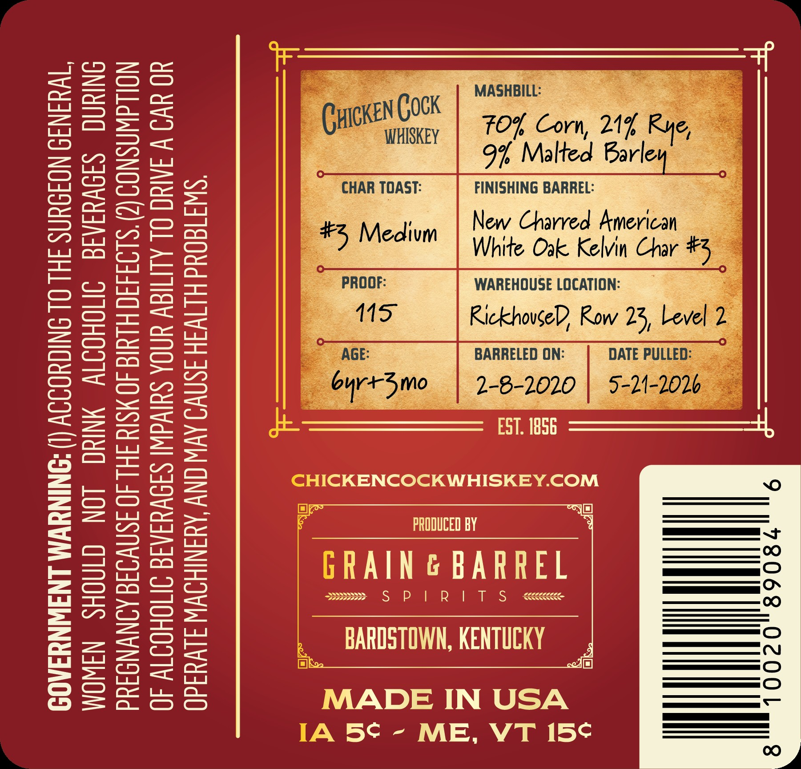
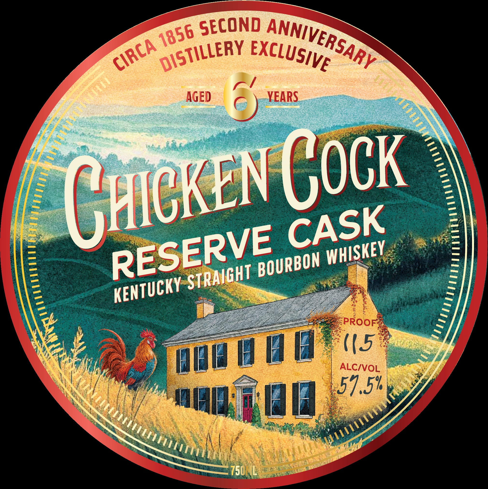

# TTB COLA Label Images - TTBID 26124001000082

**Brand Name:** CHICKEN COCK

**Fanciful Name:** RESERVE CASK

**Issue Date:** 05/07/2026

**Origin Code:** 22

**Product Class/Type:** 101

**Source:** [TTB Public COLA Registry](https://ttbonline.gov/colasonline/viewColaDetails.do?action=publicFormDisplay&ttbid=26124001000082)

## Label Images

### Back Label

### Front Label

## Extracted Label Text

*Text extracted via OCR - may contain errors*

*1 image(s) excluded: text did not meet readability threshold*

### Back Label

(I) ACCORDING TO THE SURGEON GENERAL,

WOMEN SHOULD NOT DRINK ALCOHOLIC BEVERAGES DURING
PREGNANCY BECAUSE OF THE RISK OF BIRTH DEFECTS. (2) CONSUMPTION
OF ALCOHOLIC BEVERAGES IMPAIRS YOUR ABILITY TO DRIVE A CAR OR

OPERATE MACHINERY, AND MAY CAUSE HEALTH PROBLEMS.

GOVERNMENT WARNING

FOL Corn, 21% F
9% Malted Barle:

FINISHING BARREL:

New Charred American —

White Oak Kelvin Char
WAREHOUSE LOCATION: =
RickhovseD Row 23,

BARRELED ON:

~ FST. 1856

-HICKENCOCKWHISKEY.COM

IF >IT
i PRODUCED BY

GRAIN G BARREL

ssees S$ P| RIT S  <cccccece

BARDSTOWN, KENTUCKY

MADE IN USA
[A 5S - ME, VT 15¢
