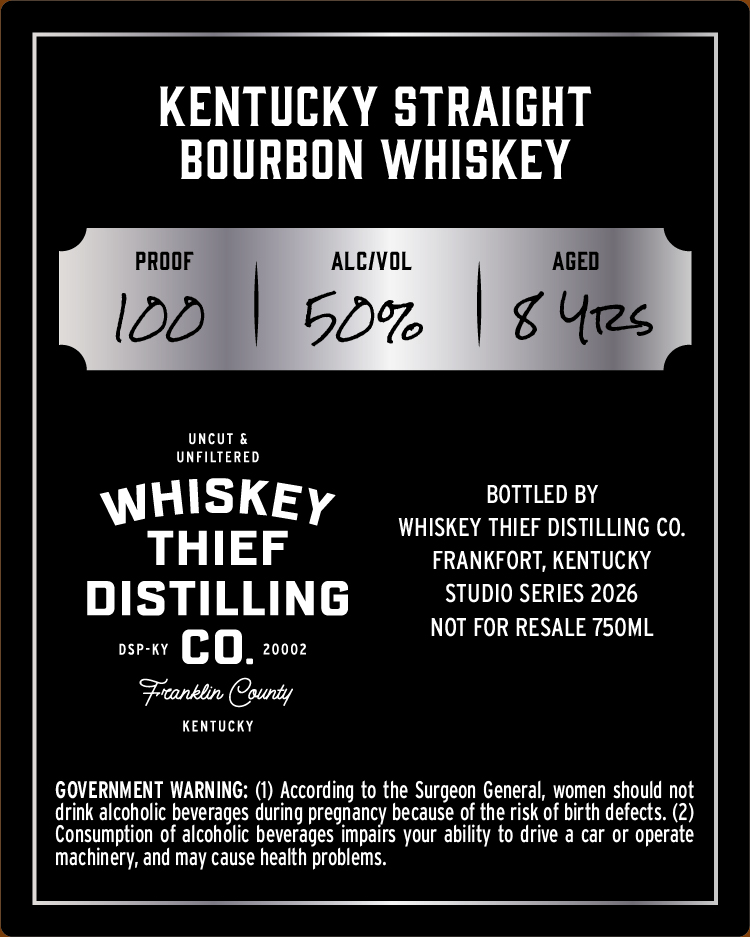
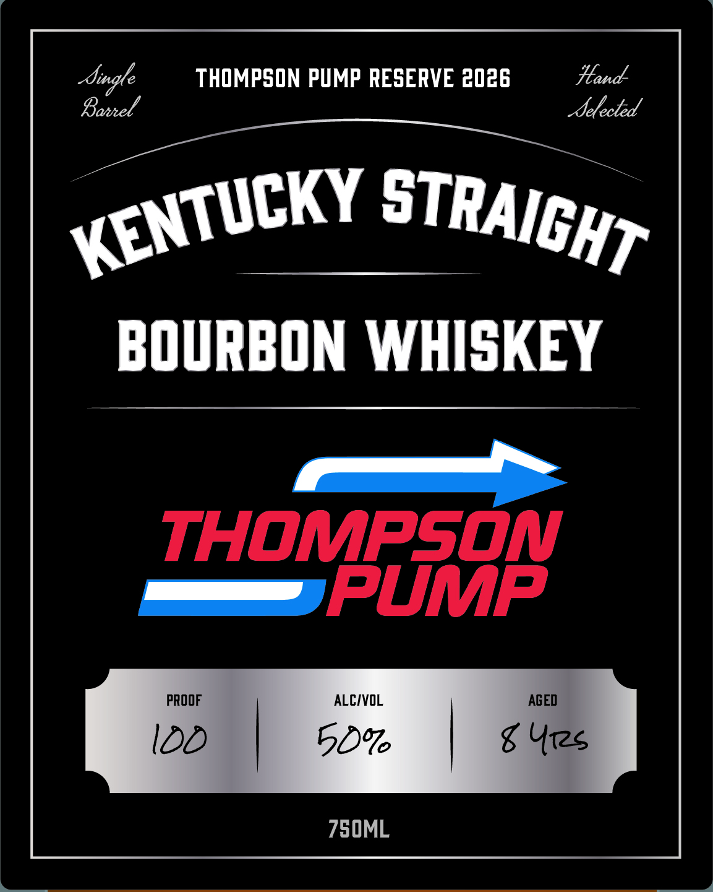

# TTB COLA Label Images - TTBID 26124001000124

**Brand Name:** WHISKEY THIEF DISTILLING CO.

**Fanciful Name:** THOMPSON PUMP

**Issue Date:** 05/07/2026

**Origin Code:** 22

**Product Class/Type:** 101

**Source:** [TTB Public COLA Registry](https://ttbonline.gov/colasonline/viewColaDetails.do?action=publicFormDisplay&ttbid=26124001000124)

## Label Images

### Back Label

### Front Label

## Extracted Label Text

*Text extracted via OCR - may contain errors*

### Back Label

KENTUCKY STRAIGHT

BOURBON WHISKEY

PROOF.

ALCIVOL

AGED

100

|

50” | 6 Yes

UNFILTERED

WHISKEy

BOTTLED BY

WHISKEY THIEF DISTILLING CO.

THIEF

FRANKFORT, KENTUCKY

DISTILLING

STUDIO SERIES 2026

NOT FOR RESALE 750ML

DSP-KY C 0. 20002

Franklin (purty

KENTUCKY

GOVERNMENT WARNING: (1) According to the Surgeon General, women should not

Consumption of alcoholic beverages impairs your ability to drive a car or operate

drink alcoholic beverages during pregnancy because of the risk of birth defects. (2)

Machinery, and may cause health problems.

### Front Label

BOURBON WHISKEY
THOMPSON
PUMP
PROOF
ALCIV
AGED
IDD
5D
g Urzs
STRAICHT
KENTUCKY
