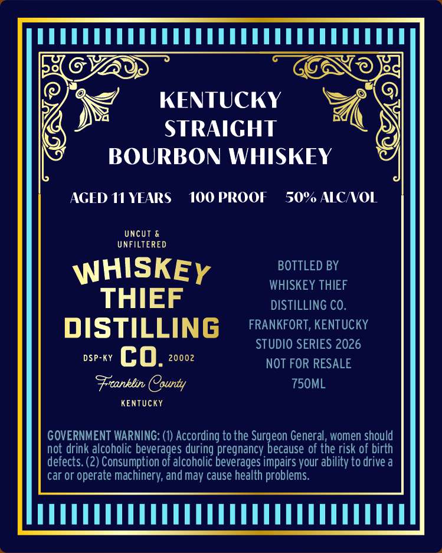
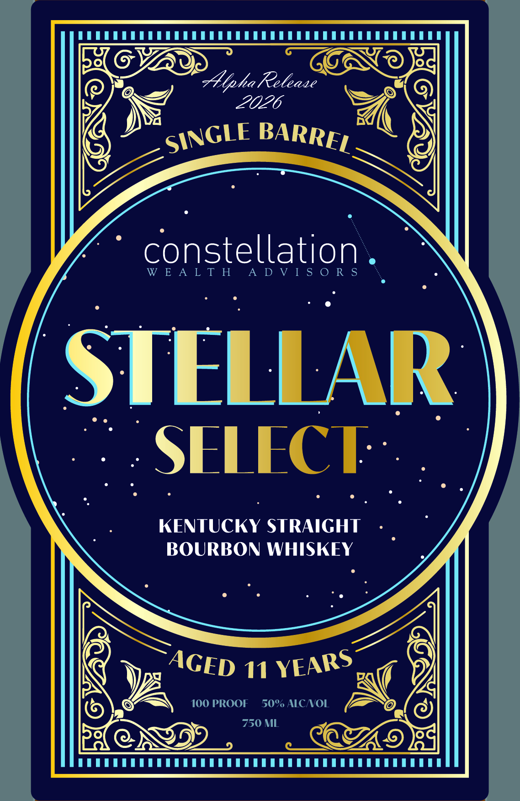

# TTB COLA Label Images - TTBID 26124001000134

**Brand Name:** WHISKEY THIEF DISTILLING CO.

**Fanciful Name:** STELLAR SELECT

**Issue Date:** 05/06/2026

**Origin Code:** 22

**Product Class/Type:** 101

**Source:** [TTB Public COLA Registry](https://ttbonline.gov/colasonline/viewColaDetails.do?action=publicFormDisplay&ttbid=26124001000134)

## Label Images

### Back Label

### Front Label

## Extracted Label Text

*Text extracted via OCR - may contain errors*

**Detected Proof:** 100

### Back Label

KENTUCKY
STRAIGHT
BOURBON WHISKEY
AGED I1 YEARS
100 PROOF
50% AICNOL
Uncut &
UNFILTERED
WHISKEY
BOTTLED BY
WHISKEY THIEF
THIEF
DISTILLING CO.
DISTILLING
FRANKFORT, KENTUCKY
STUDIO SERIES 2026
DSP-KY
co.
20002
NOT FOR RESALE
Frcanklin County
750ML
KENTUcKY
GOVERNMENT WARNING: (1) According to the Surgeon General , women should
not drink alcoholic
peioradascdhonc Beveraaes imecarssyour abaiytodrbveh
defects: (2) Consumption
alcoholic beverages impairs your ability to drive a
car or operate machinery; andmay cause health problems

### Front Label

PERRE EERE EERE

ELGVAD

oe

es

a,

\NGLE BARRE)

ty

constellation

EALTH ADVISORS

STELLAR

/ SELECE

KENTUCKY STRAIGHT

BOURBON WHISKEY

Sa: "1 NE

az

A

~O SP

CASE

|
