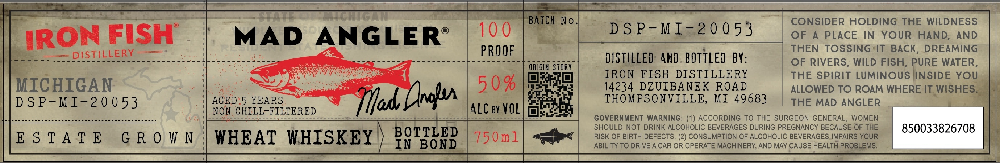

# TTB COLA Label Images - TTBID 26124001000150

**Brand Name:** MAD ANGLER

**Issue Date:** 05/06/2026

**Origin Code:** 06

**Product Class/Type:** 140

**Source:** [TTB Public COLA Registry](https://ttbonline.gov/colasonline/viewColaDetails.do?action=publicFormDisplay&ttbid=26124001000150)

## Label Images

### Label 1

## Extracted Label Text

*Text extracted via OCR - may contain errors*

**Detected Age:** 5 Years

### Label 1

tat
MChIGAN
BATCH No_
CONSIDER HOLDING THE WILDNESS
IRON FISH
MAD ANGLER
10 0
D S P-MI-20 0 53
OF
A
PLACE
IN
YOUR
HAND;
AND
PROOF
THEN TOSSING IT
BACK
DREAMING
DISTILLERY
DISTILLED AND.BOTTLED BY:
OF RIVERS, WILD FISH, PURE WATER,
ORISIK STORY
IRON FISH DISTILLERY
THE SpiRIT LUMinOUS INSIDE YoU
MICHIGAN
5 0 %
14234 DZUIBANEK
ROAD
ALLOWED TO ROAM WHERE IT WISHES
D S P- M I-2 0 0 53
AGED:5 YEARS:
Tfad Dls
THOMPSONVILLE,
MI 49683
THE MAD ANGLER
NON CHILL-FILTERED
ALC by VOL
GOVERNMENT WARNING: (1) ACCORDING TO THE SURGEON GENERAL
WOMEN
SHOULD NOT DRINK ALCOHOLIC BEVERAGES DURING PREGNANCY BECAUSE OF THE
850033826708
E S T A T E
G R 0 W N
WHEAT WHISKEY
BOTTLED
750m1
RISK OF BIRTH DEFECTS. (2) CONSUMPTION OF ALCOHOLIC BEVERAGES IMPAIRS YOUR
In
BOND
ABILITY TO DRIVE A CAR OR OPERATE MACHINERY, AND MAY CAUSE HEALTH PROBLEMS
