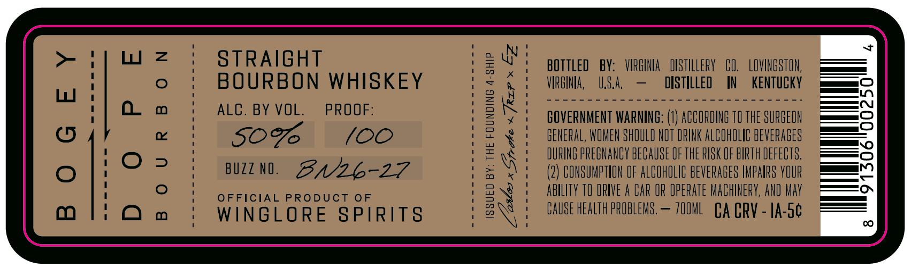

# TTB COLA Label Images - TTBID 26124001000241

**Brand Name:** WINGLORE SPIRITS

**Fanciful Name:** BOGEY DOPE BOURBON

**Issue Date:** 05/07/2026

**Origin Code:** 05

**Product Class/Type:** 101

**Source:** [TTB Public COLA Registry](https://ttbonline.gov/colasonline/viewColaDetails.do?action=publicFormDisplay&ttbid=26124001000241)

## Label Images

### Label 1

### Label 2

## Extracted Label Text

*Text extracted via OCR - may contain errors*

### Label 1

STRAIGHT
04
bOTTLeD
BY:   VIRGINIA
DISTILLERY
CO,
LOVINGSTON;
BOURBON WHISKEY
VIRGINA,
U.S.A,
DISTILLED
IN
KENTuCKY
0
ALC. BY VOL.
PROOF:
ie
GOVERNMENT WARNING: (1) ACCORDINE TO THE SURGEON
6
507
(00
GENERAL, WOMEN SHOULD NOT DRINK ALCOHOLIC BEVERAGES
4
IURING PREGNANCY HECAUSE OF THE RISK OF BIRTH DEFECTS.
BUZZ NO.
3N26-27
6
{
(2) CONSUMPTION OF ALCOHOLIC BEVERAGES IMPAIFS VOUR
OFFICIAL
PRODUCT 0F
abilIty TO DRIVE a BAR OR OpeRATe MAChNERY, AND May
WINGLORE
SPIRITS
8
CAUSE HEaLTh PROBLEMS ,
70OML
CA CRV - IA-Sc
cO

### Label 2

IN
THE
WORLD
OF
FIGHTER
PILOTS,
#BOGEY
DOPE"
IS
A
S TRAIGHT
REQUEST
FOR
THE
LOCATION
OF
THE
NEAREST
TARGET
B OURBON
WHETHER BOGEY, BANDIT, OR
HOSTILE. WE'VE TAKEN THE
SAME METHODICAL APPROACH IN SEEKING OUT OUR TARGET:
WHISKEY
THE
BEST
DAMN
BOURBON
WE
COULD
PUT
IN
BOTTLE.
