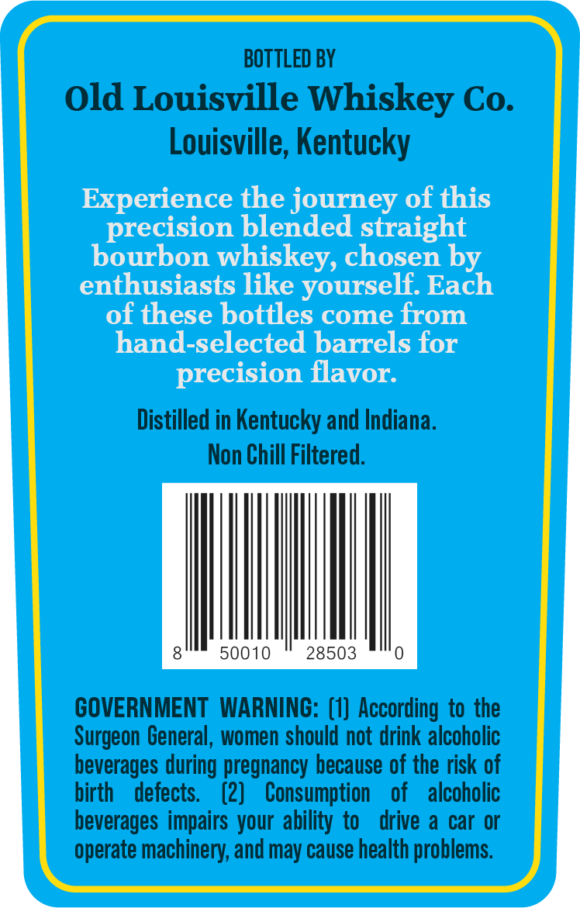
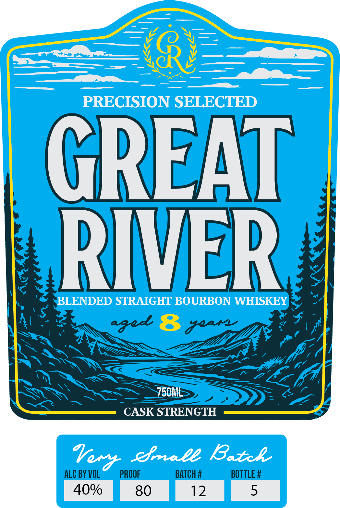

# TTB COLA Label Images - TTBID 26124001000277

**Brand Name:** GREAT RIVER

**Issue Date:** 05/18/2026

**Origin Code:** 22

**Product Class/Type:** 121

**Source:** [TTB Public COLA Registry](https://ttbonline.gov/colasonline/viewColaDetails.do?action=publicFormDisplay&ttbid=26124001000277)

## Label Images

### Back Label

### Front Label

## Extracted Label Text

*Text extracted via OCR - may contain errors*

**Detected Proof:** 80

### Back Label

BOTTLED BY
Old Louisville Whiskey Co
Louisville, Kentucky
Experience the journey of this
precision blended straight
bourbon whiskey, chosen by
enthusiasts like yourself: Each
of these bottles come from
hand-selected barrels for
precision flavor:
Distilled in Kentucky and Indiana.
Non Chill Filtered.
50010
28503
GOVERNMENT  WARNING: (1} According to the
Surgeon General, women should not drink alcoholic
beverages during pregnancy because of the risk of
birth
defects.
(2)
Consumption
of
alcoholic
beverages impairs your ability to
drive a car or
operate machinery; and may cause health problems

### Front Label

PRECISION SELECTED
GREAT
RIVVER
BLENDED STRAIGHT BOURBON WHISKEY
aged 8 4er
750ML
CASK STRENGTH
Iery
efaale Ratcl
ALC BY VOL
PROOF
BATCH #
BOTTLE #
40%
80
12
5
