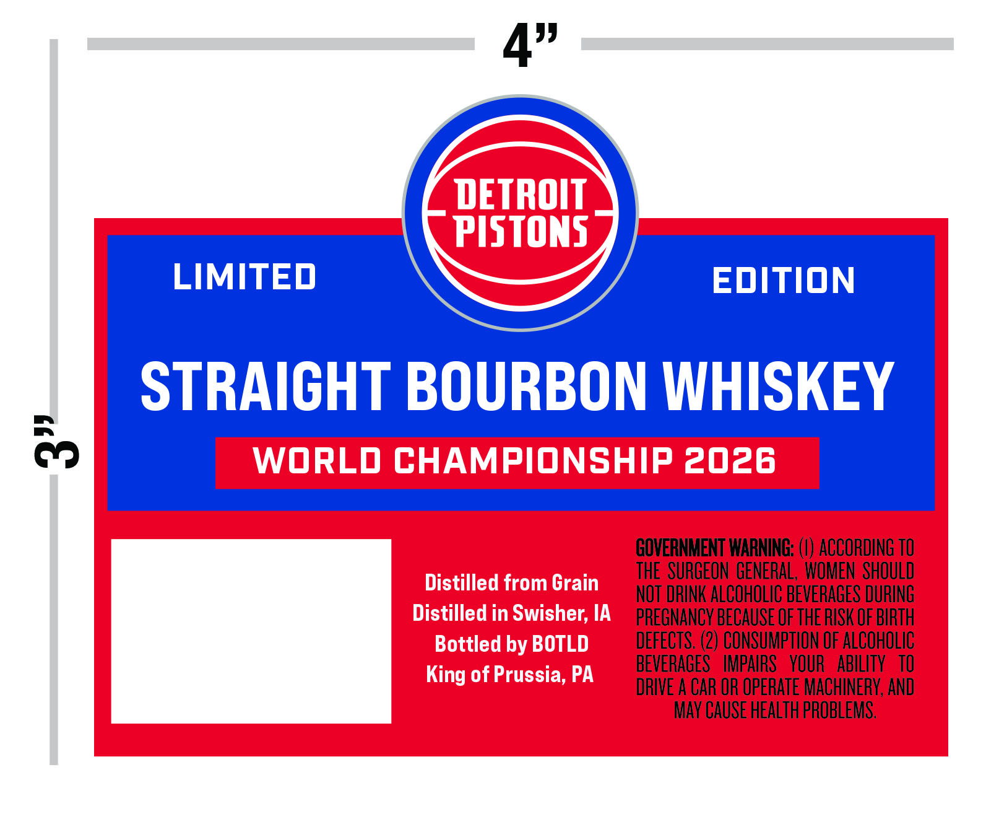
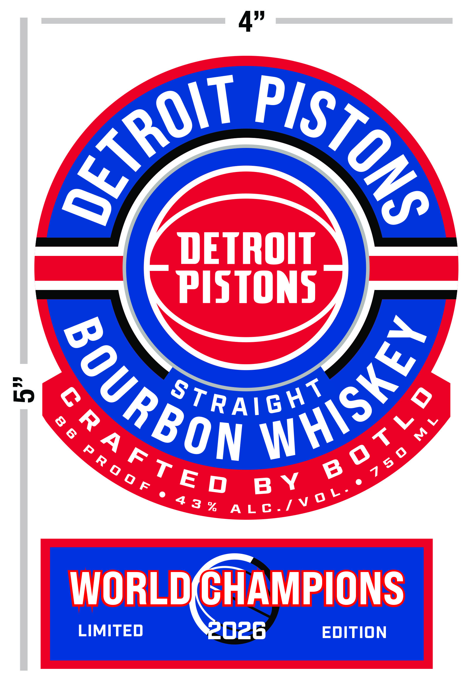

# TTB COLA Label Images - TTBID 26124001000303

**Brand Name:** DETROIT PISTONS

**Issue Date:** 05/07/2026

**Origin Code:** 39

**Product Class/Type:** 101

**Source:** [TTB Public COLA Registry](https://ttbonline.gov/colasonline/viewColaDetails.do?action=publicFormDisplay&ttbid=26124001000303)

## Label Images

### Back Label

### Front Label

## Extracted Label Text

*Text extracted via OCR - may contain errors*

*1 image(s) excluded: text did not meet readability threshold*

### Back Label

4"
DETROIT
PISTONS
LIMITED
EDITION
STRAICHT BOURBON WHISKEY
83
WORLD CHAMPIONSHIP 2026
GOVERNMENT WARNING:
ACCORDING TO
THE SURGEON  GENERAL, WOMEN  SHOULD
Distilled from Grain
NOT DRINK ALCOHOLIC BEVERAGES DURING
Distilled in Swisher; IA
PREGNANCY BECAUSE OF THE RISK OF BIRTH
Bottled by BOTLD
DEFECTS, (2) CONSUMPTION OF ALCOHOLIC
King of Prussia; PA
BEVERAGES   IMPAIRS   VOUR   ABILITY   TO
DRIVE A CAR OR OPERATE MACHINERV, ANd
May CAUSE HEALTh PROBLEMS,
