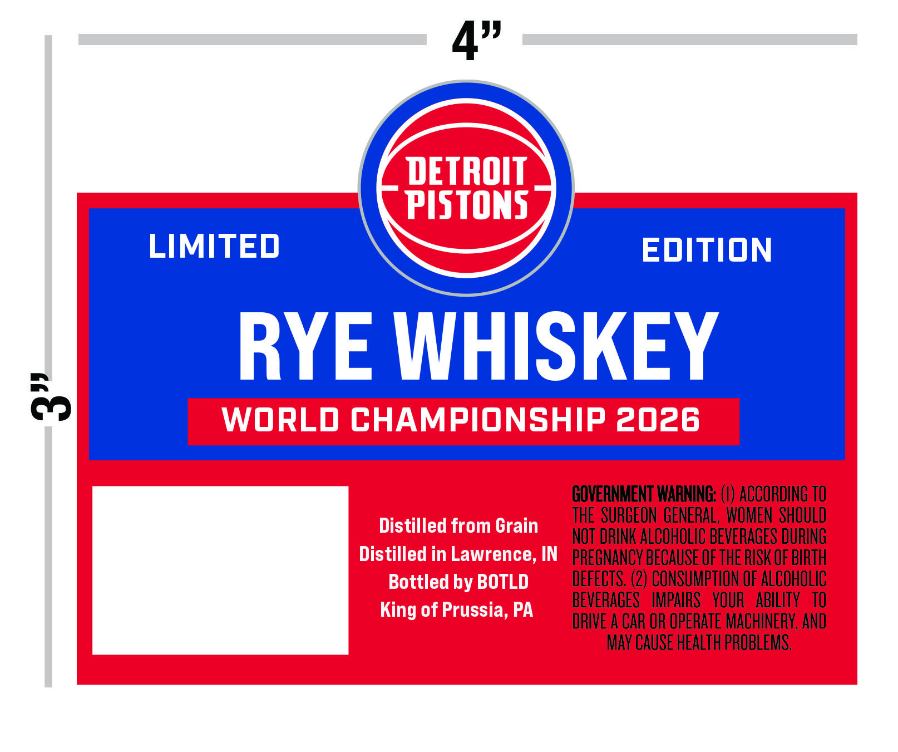
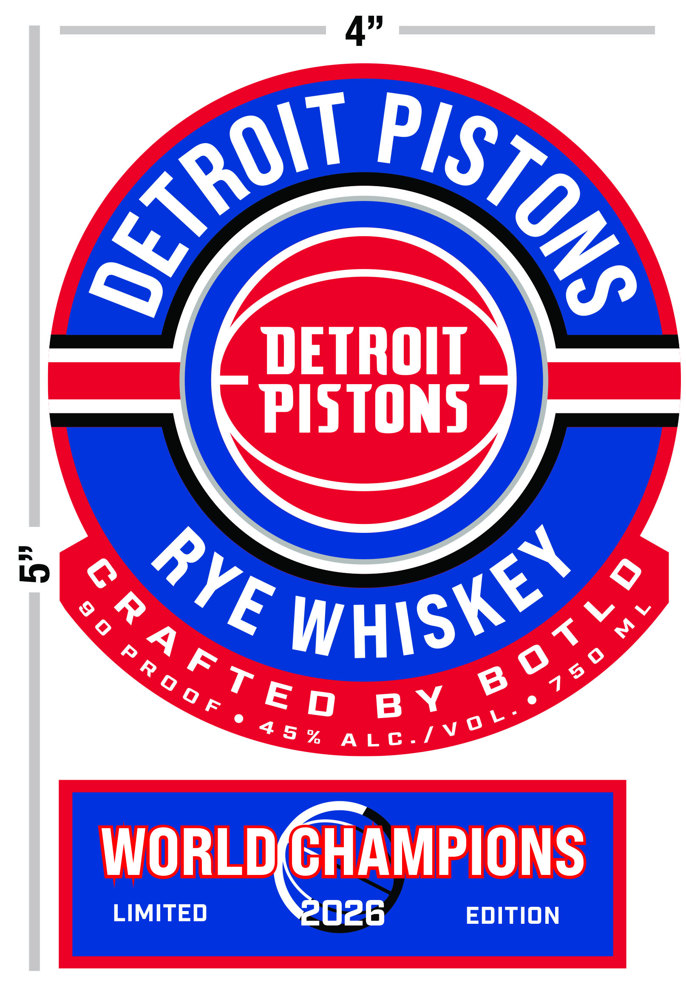

# TTB COLA Label Images - TTBID 26124001000305

**Brand Name:** DETROIT PISTONS

**Issue Date:** 05/07/2026

**Origin Code:** 19

**Product Class/Type:** 142

**Source:** [TTB Public COLA Registry](https://ttbonline.gov/colasonline/viewColaDetails.do?action=publicFormDisplay&ttbid=26124001000305)

## Label Images

### Back Label

### Front Label

## Extracted Label Text

*Text extracted via OCR - may contain errors*

### Back Label

4"
DETROIT
PISTONS
LIMITED
EditioN
RYE WHISKEY
63
WORLD CHAMPIONSHIP 2026
GOVERNMENT WARNING:
ACCORDING TO
THE SURGEON  GENERAL ,  WOMEN  SHOULD
Distilled from Grain
NOT DRINK ALCOHOLIC BEVERAGES DURING
Distilled in Lawrence, IN
PREGNANCY BECAUSE OF THE RISK OF BIRTH
Bottled by BOTLD
DEFECTS. (2) CONSUMPTION OF ALCOHOLIC
BEVERAGES   IMPAIRS   YOUR   ABILITY
TO
King of Prussia; PA
DRIVE A CAR OR OPERATE MACHINERV; AND
May CAUSe HEalTh PROBLEMS,

### Front Label

4"
DETROIT
PISTONS
3
Saye Whishe s
0
WORLDCHAMPIONS
LIMITED
2026
EDItion
OETROIT
PISTONs
WHISKEY
RYE
0
M L
7 5 0
R 0 0 F
A LC./V 0 L _
4 5 %
