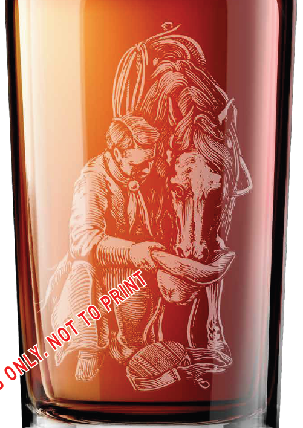
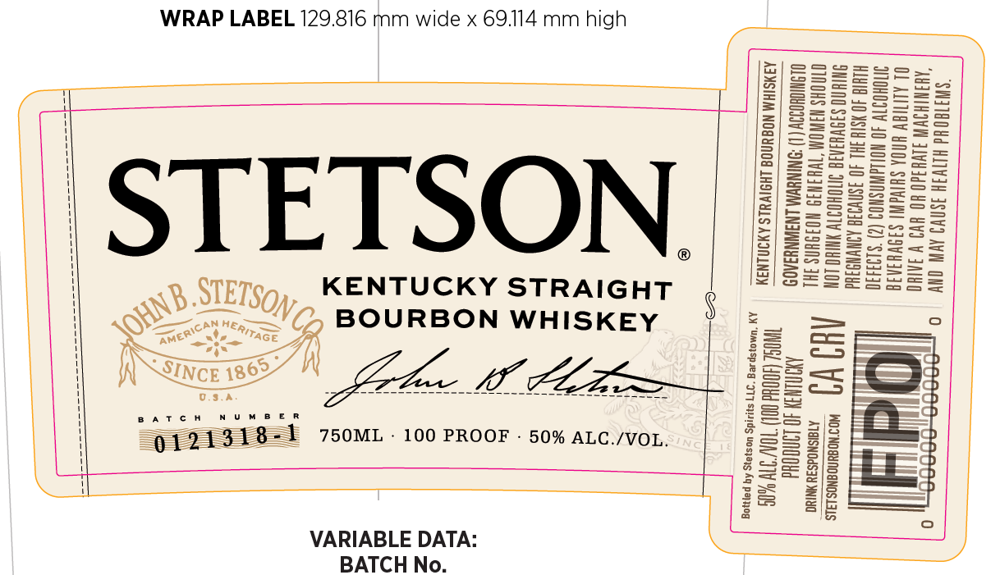
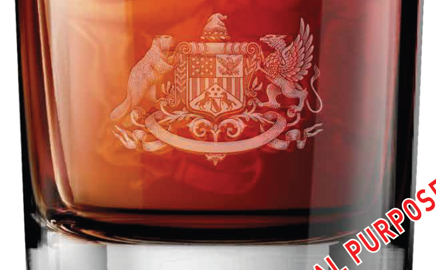
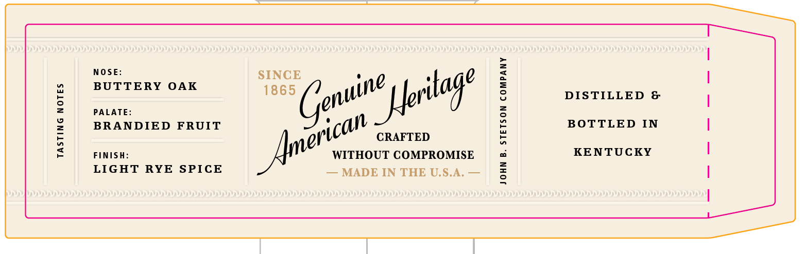

# TTB COLA Label Images - TTBID 26124001000397

**Brand Name:** STETSON

**Issue Date:** 05/08/2026

**Origin Code:** 22

**Product Class/Type:** 101

**Source:** [TTB Public COLA Registry](https://ttbonline.gov/colasonline/viewColaDetails.do?action=publicFormDisplay&ttbid=26124001000397)

## Label Images

### Back Label

### Label 1

### Label 2

### Label 4

## Extracted Label Text

*Text extracted via OCR - may contain errors*

*3 image(s) excluded: text did not meet readability threshold*

### Label 4

NOSE

SINCE

BUTTERY OAK

1865

DISTILLED &

PALATE

BRANDIED FRUIT

BOTTLED IN

sal" CRAFTED

FINISH

WITHOUT COMPROMISE

KENTUCKY

LIGHT RYE SPICE

Amer

— MADE IN THE U.S.A, —
