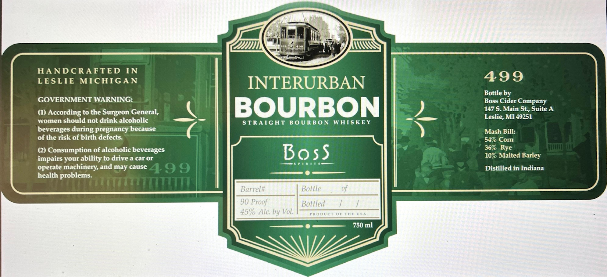

# TTB COLA Label Images - TTBID 26124001000513

**Brand Name:** BOSS SPIRITS

**Fanciful Name:** INTERURBAN BOURBON

**Issue Date:** 05/08/2026

**Origin Code:** 06

**Product Class/Type:** 101

**Source:** [TTB Public COLA Registry](https://ttbonline.gov/colasonline/viewColaDetails.do?action=publicFormDisplay&ttbid=26124001000513)

## Label Images

### Label 1

## Extracted Label Text

*Text extracted via OCR - may contain errors*

**Detected Proof:** 90

### Label 1

HANDCRAFTED
IN
LESLIE
MICHIGAN
INTERURBAN
499
Bottle by
GOVERNMENT WARNING:
Boss Cider Company
(1)
According to the Surgeon General,
BOURBON
147 S.Main St, Suite A
Leslie; MI 49251
women should not drink alcoholic
STRAIGHT
BO URBON
WHISKEY
beverages during pregnancy because
Mash Bill:
of the risk of birth defects:
54% Corn
(2) Consumption of alcoholic beverages
Boss
36% Rye
impairs your ability to drive a car or
10% Malted Barley
operate machinery and may cause
499
Distilled in Indiana
health problems:
Barrel#
Bottle
90 Proof
Bottled
459 Alc: by Vol.
FRODuci
0I
TL
L (
750 ml
