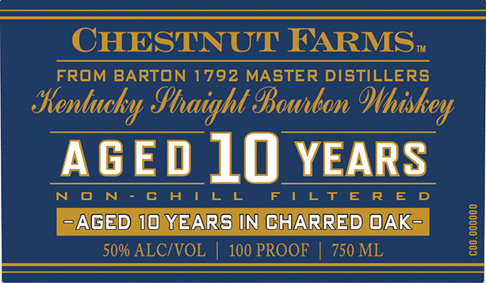
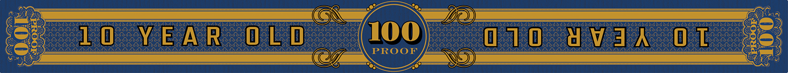

# TTB COLA Label Images - TTBID 26124001000537

**Brand Name:** CHESTNUT FARMS

**Issue Date:** 05/07/2026

**Origin Code:** 22

**Product Class/Type:** 101

**Source:** [TTB Public COLA Registry](https://ttbonline.gov/colasonline/viewColaDetails.do?action=publicFormDisplay&ttbid=26124001000537)

## Label Images

### Back Label

### Label 1

### Label 4

## Extracted Label Text

*Text extracted via OCR - may contain errors*

*2 image(s) excluded: text did not meet readability threshold*

**Detected Proof:** 100
**Detected Age:** 10 Years

### Label 1

CHESTNUT FARMS;
FROM BARTON 1792 MASTER DISTILLERS
Sentucky Shaight Bounbon
AGED 10 YEARS
N -
A | L
F | Lt E
AGed 10 YEARs IN CHARRED OAK-
1
50% ALCIVOL
100 PROOF
750 ML
8
Ohiskey
