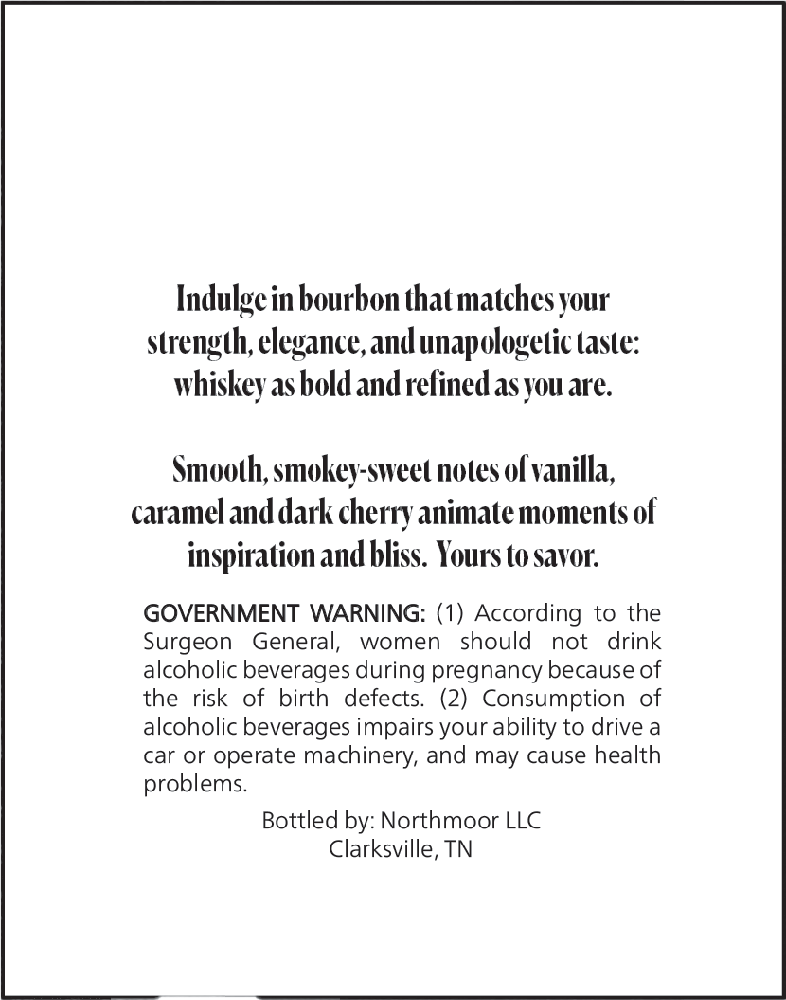
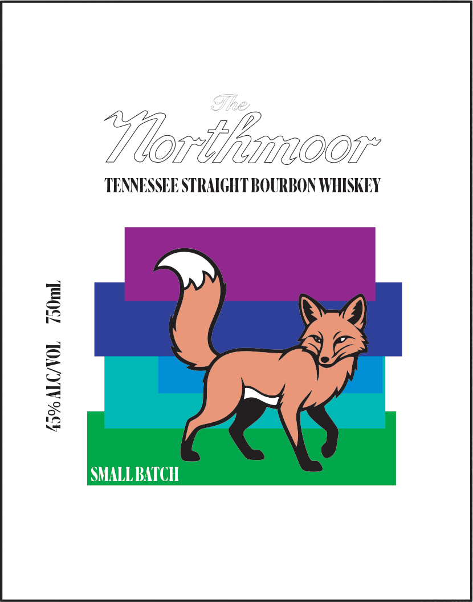

# TTB COLA Label Images - TTBID 26124001000584

**Brand Name:** NORTHMOOR

**Issue Date:** 05/07/2026

**Origin Code:** 43

**Product Class/Type:** 101

**Source:** [TTB Public COLA Registry](https://ttbonline.gov/colasonline/viewColaDetails.do?action=publicFormDisplay&ttbid=26124001000584)

## Label Images

### Back Label

### Front Label

## Extracted Label Text

*Text extracted via OCR - may contain errors*

### Back Label

Indulge in bourbon that matches your

strength, elegance, and unapologetic taste:

whiskey as bold and refined as you are.

Smooth, smokey-sweet notes of vanilla,

caramel and dark cherry animate moments of

inspiration and bliss. Yours to savor.

GOVERNMENT WARNING: (1) According to the

Surgeon General, women should not drink

alcoholic beverages during pregnancy because of

the risk of birth defects. (2) Consumption of

alcoholic beverages impairs your ability to drive a

car or operate machinery, and may cause health

problems.

Bottled by: Northmoor LLC

Clarksville, TN

### Front Label

Voit omoor

TENNESSEE STRAIGHT BOURBON WHISKEY

™

el

Te}

&

SMALL BATCH
