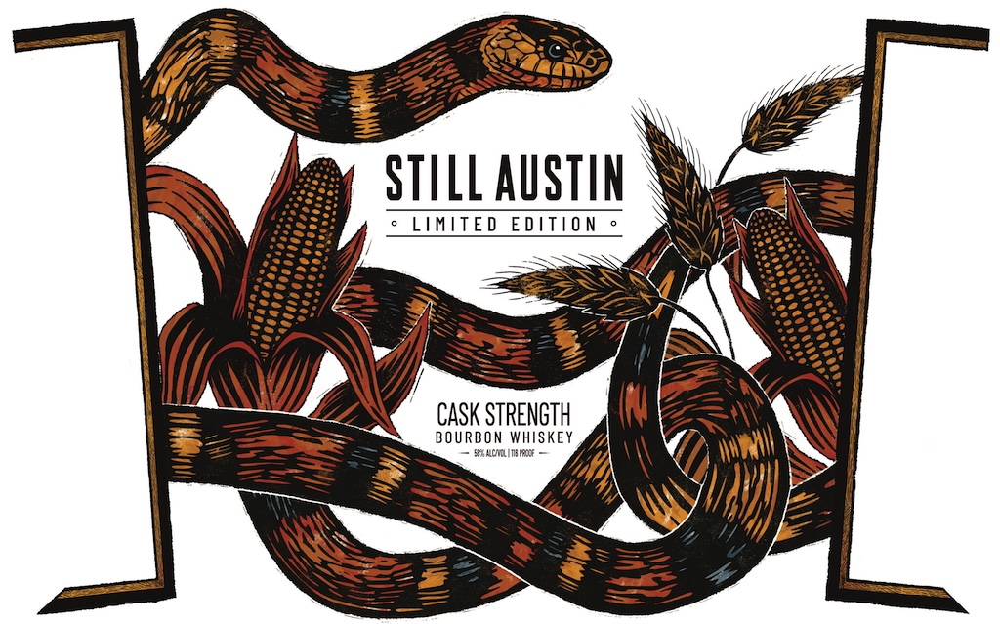
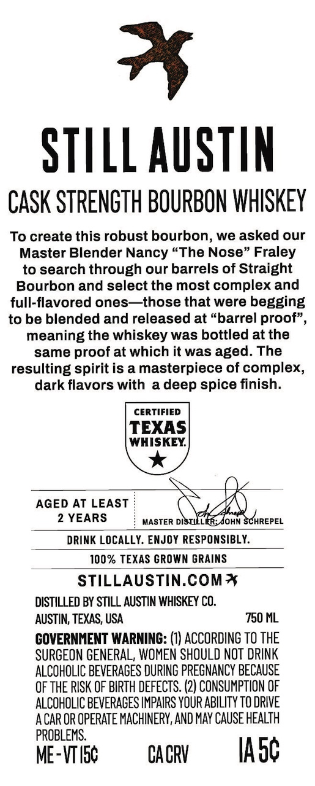

# TTB COLA Label Images - TTBID 26124001000657

**Brand Name:** STILL AUSTIN

**Fanciful Name:** CASK BOURBON LIMITED EDITION

**Issue Date:** 05/12/2026

**Origin Code:** 44

**Product Class/Type:** 141

**Source:** [TTB Public COLA Registry](https://ttbonline.gov/colasonline/viewColaDetails.do?action=publicFormDisplay&ttbid=26124001000657)

## Label Images

### Label 1

### Label 2

## Extracted Label Text

*Text extracted via OCR - may contain errors*

**Detected Age:** 2 Years

### Label 1

STILL AuStin
LIMITED
EDItio N
CASK STRENGTH
BOURBON WHISKEY
snciimar

### Label 2

STILL AUSTIN
CASK STRENGTH BOURBON WHISKEY
To create this robust bourbon, we asked our
Master Blender Nancy "The Nose" Fraley
to search through our barrels of Straight
Bourbon and select the most complex and
full-flavored ones
those that were begging
to be blended and released at "barrel proof"
meaning the whiskey was bottled at the
same proof at which it was aged: The
resulting spirit is a masterpiece of complex,
dark flavors with
deep spice finish:
CERTIFIED
TEXAS
WHISKEY
AGED AT LEAST
2 YEARS
MASTER DISTILLER:JOHN SCHREPEL
DRINK LOCALLY. ENJOY RESPONSIBLY:
100% TEXAS GROWN GRAINS
STILLAUSTIN.COMx
DISTILLED BY STILL AUSTIN WHISKEY CO.
AUSTIN; TEXAS; USA
750 ML
COVERNHENT WARNING: (1) ACCORDING TO THE
SURGEON GENERAL, WOMEN SHOULD NOT DRINK
ALCOHOLIC BEVERAGES DURING PREGNANCY BECAUSE
OF THE RISK OF BIRTH DEFECTS. (2) CONSUMPTION OF
ALCOHOLIC BEVERAGES IMPAIRS YOUR ABILITY TO DRIVE
A CAR OR OPERATE MACHINERY, AND MaY CAUSE HEALTH
PROBLEMS:.
ME-VTI5c
CA CRV
Iasc
