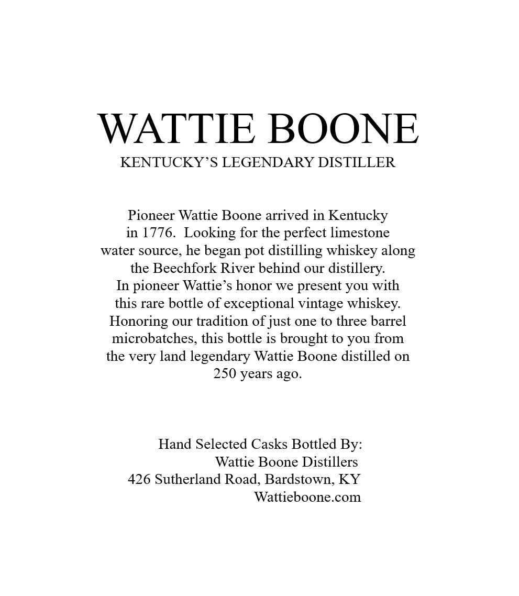
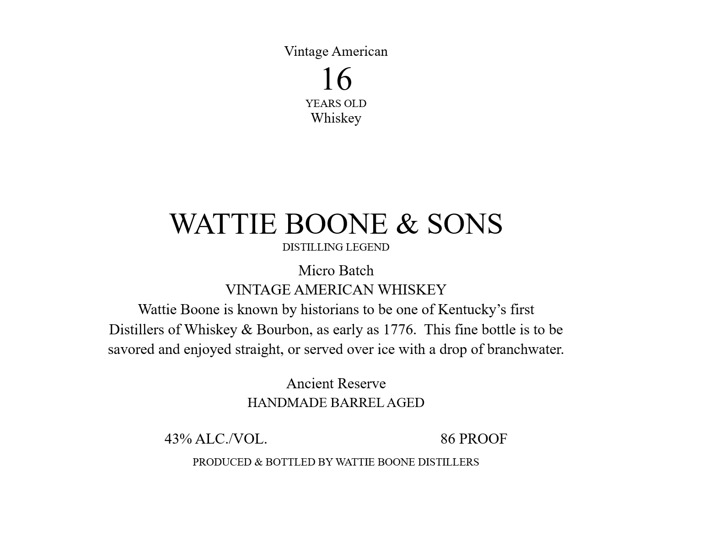
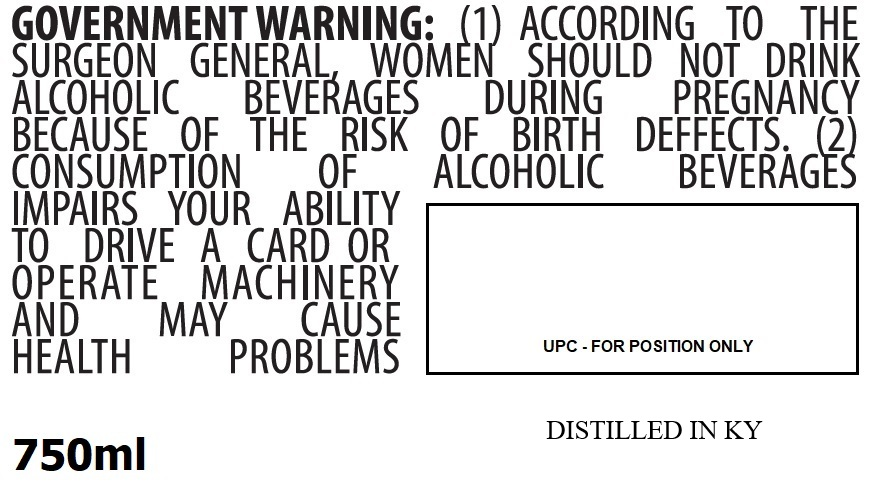

# TTB COLA Label Images - TTBID 26124001000764

**Brand Name:** WATTIE BOONE & SONS

**Issue Date:** 05/11/2026

**Origin Code:** 22

**Product Class/Type:** 140

**Source:** [TTB Public COLA Registry](https://ttbonline.gov/colasonline/viewColaDetails.do?action=publicFormDisplay&ttbid=26124001000764)

## Label Images

### Back Label

### Label 1

### Label 3

### Label 4

## Extracted Label Text

*Text extracted via OCR - may contain errors*

*1 image(s) excluded: text did not meet readability threshold*

**Detected Proof:** 86
**Detected Age:** 16 Years

### Back Label

WATTIE BOONE
KENTUCKY S LEGENDARY DISTILLER
Pioneer Wattie Boone arrived in Kentucky
in 1776. Looking for the perfect limestone
water source, he
began pot distilling whiskey along
the Beechfork River behind our distillery:
In pioneer Wattie's honor we present you with
this rare bottle of exceptional vintage whiskey:
Honoring our tradition of just one to three barrel
microbatches, this bottle is brought to you from
the very land legendary Wattie Boone distilled o
250 years ago_
Hand Selected Casks Bottled By:
Wattie Boone Distillers
426 Sutherland Road, Bardstown; KY
Wattieboone.com

### Label 1

Vintage American
16
YEARS OLD
Whiskey
WATTIE BOONE & SONS
DISTILLNNG LEGEND
Micro Batch
VINTAGE AMERICAN WHISKEY
Wattie Boone is known by historians to be one of Kentucky's first
Distillers of Whiskey & Bourbon, as early as 1776.
This fine bottle is to be
savored and enjoyed straight; or served over ice with a drop of branchwater:
Ancient Reserve
HANDMADE BARREL AGED
43% ALC NOL
86 PROOF
PRODUCED & BOTTLED BY WATTEE BOONE DISTILLERS

### Label 3

GOVERNMENT WARNING:
ACCORDING
TO
THE
SURGEON
GENERAL
WNGmer) .
SHOULD
NOT
DRINK
AicoHoLic
BEVERAGES
DURiNG
PREGNANCY
BECAUSE
OF
THE
RISK
OF
BIRTH
DEFFECTS
2
CONSUMpTION
OF
AlcohoLic
BEVERAGES
IMPAIRS
YOUR
ABILITY
TO
DRIVE
A
CARD OR
OPERATE
MACHINERY
And
MAY
CAUSE
UPC - FOR POSITION ONLY
HeALTH
PROBLEMS
DISTILLED IN KY
750ml
