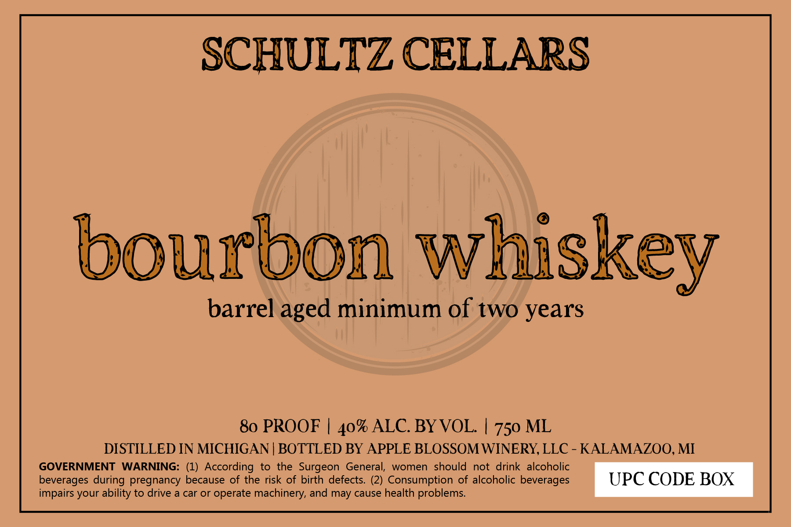

# TTB COLA Label Images - TTBID 26124001000823

**Brand Name:** SCHULTZ CELLARS

**Issue Date:** 05/11/2026

**Origin Code:** 06

**Product Class/Type:** 141

**Source:** [TTB Public COLA Registry](https://ttbonline.gov/colasonline/viewColaDetails.do?action=publicFormDisplay&ttbid=26124001000823)

## Label Images

### Label 1

## Extracted Label Text

*Text extracted via OCR - may contain errors*

**Detected Proof:** 80

### Label 1

SCHULTZ CELLARS
bourbon whiskey
barrel
minimum of two years
80 PROOF
ALC. BYVOL
750 ML
DISTILLED IN MICHIGAN | BOTTLED BY APPLE BLOSSOM WINERY, LLC - KALAMAZOO, MI
GOVERNMENT
WARNING: (1) According to the Surgeon
General;
women should
not
drink  alcoholic
beverages during pregnancy
because of the risk of birth defects (2) Consumption of alcoholic beverages
UPC CODE BOX
impairs your ability to drive
a car Or
operate machinery, and may cause health problems
aged
40%
